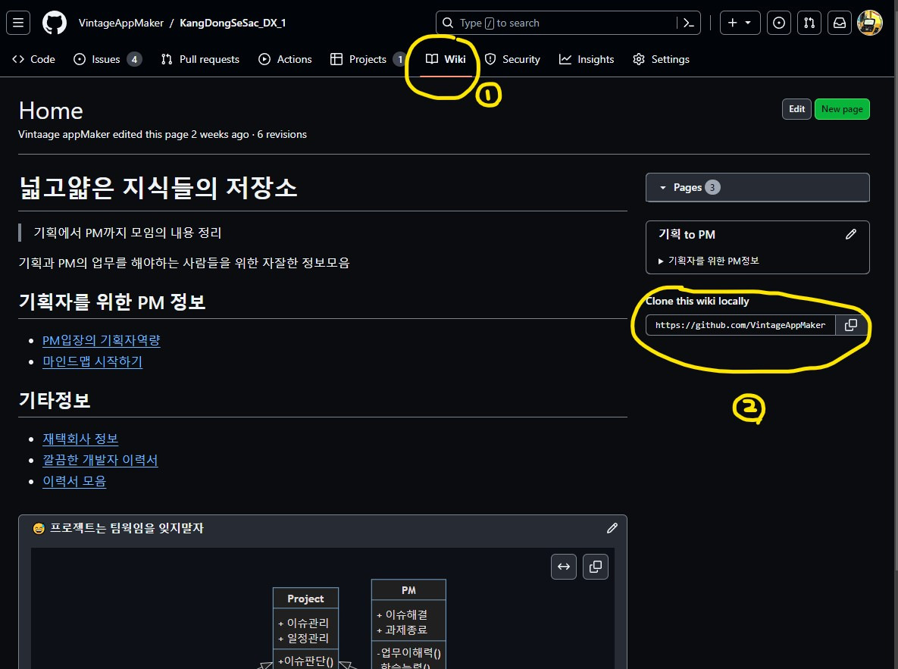

# 3. github을 통한 정보공유

## 1. wiki
> `wiki를 사용하는 이유`
>1. **편리한 문서화**: 프로젝트의 세부 정보, 사용 방법, 설치 지침, 기여 가이드라인 등과 같은 문서
>2. **Markdown 사용**: GitHub Wiki는 Markdown 문법을 지원
>3. **연결성 및 편의성**: Wiki 페이지 간에 하이퍼링크를 생성하여 서로 연결  
>4. **버전 관리**:  Git을 기반으 변경 내용을 추적 및  버전 관리
>5. **협업 및 기여**: 여러 사용자가 협업하여 문서를 작성

wiki는 repository에서 만들 수 있다. 그리고 public으로 설정된 경우에만 가능하다. 


- [수업을 위한 WIKI 템플릿](https://github.com/VintageAppMaker/KangDongSeSac_DX_1/wiki)
- [github의 wiki 메뉴얼](https://docs.github.com/ko/communities/documenting-your-project-with-wikis/about-wikis)

## 2. github blog
> `github blog는 static html로 무료`로 사용가능하다. 
> (1) markdown으로 작성해도 Web page로 보여준다. 
> (2) html을 바로 올려서 Web page로 보여준다. 
> (3) jekyll을 이용하여 markdown을 rich하게  Web page로 보여준다.

1. `jekyll 설정`
    1. [http://jekyllthemes.org/](http://jekyllthemes.org/)에 가서 쇼핑한다.  
    2. 원하는 테마를 고르고 [Homepage](#)를 클릭한다. 
    3. 제작자의 github으로 이동된다.
    4. 상단 메뉴에서 [Folk](#)를 선택한다. 그러면 나의 Repositories에 Folk된다. 
    5. Folk된 Repository를 [계정명.github.io](#)로 한다. 
    4. commit 하고 push 한다. 
    5. 한 참 후에 [https://자신의 계정명.github.io](#)로 접속해본다.
    6. [Jekyll](https://jekyllrb.com/tutorials/home/)과 markdown을 공부하며 github blog를 만들어본다. 
    7. 예제: [Vintage appMaker github blog](https://vintageappmaker.github.io/)
2. `기사작성법`
	- 레포지토리의 `_posts` 디렉토리에 markdown 파일을 저장하면 포스팅. 
	- Jekyll에서는 Markdown 형식으로 포스트(기사)를 작성한다. 
	- Jekyll의 포스트 파일은 파일명이 `YYYY-MM-DD-title.md` 형식 
	- 파일의 맨처음은 YAML front matter. 
~~~
---
layout: post
title: "타이틀명"
date: 2024-01-19 10:00:00 +0900
categories: 카타고리명
---

포스트 내용작성

~~~
3. `_config.yml`
	- jekyll로 만든 사이트의 이름 및 기타 정보를 설정하는 파일. 
	-  '#' 은 주석으로 설정에 적용되지 않는 사용자를 위한 설명임 
	- jekyll theme 마다 약간씩 다른 설정을 가지고 있음 
	- **정확히 이해하려면 ruby라는 개발환경에서 세팅**을 심도있게  공부해야 함
	- 그래서 fork를 해서 가져왔을 때는 
		- _config.yml 주석으로 된 내용을 보고 
		- `사용자가 주석을 보며 수정`하며 확인
		- 그러면서 학습하는 것이 현명함 

---

#TODO
## 3. Mission
> 아래의 내용을 github blog나 wiki에 퍼블리싱 한다.
```
1. PM의 역할
2. project 기초상식
3. issue 관리 시스템 요약 및 사용법
```

