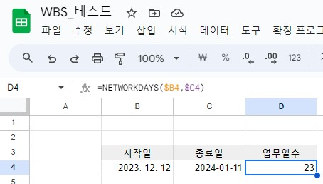
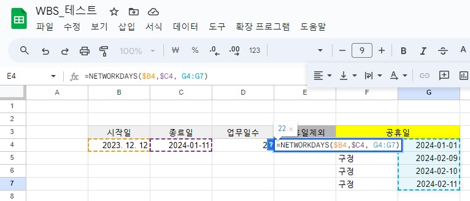

Google Sheet로 WBS를 작성하다 보면 자동화를 만들어야 할 때가 종종 생긴다. Google Sheet를 모르더라도 반드시 알아야 할 서식에 대해 정리한다. Excel 전문가가 아니라면 조건부 서식과 IF문을 중복으로 사용하는 경우가 쉽다. 

## 1.1.1 생존 조건부 서식

- 조건에 따라 배경색 바꾸기
	  
- 값에 따라 그래프로 보이기
	  

1. **값 범위에 따라 색상 변경하기:**
    - 조건식: `=AND(A1 >= 0, A1 <= 10)`
    - 설명: A1 셀 값이 0 이상 10 이하인 경우.
2. **텍스트 값에 따라 서식 변경하기:**
    - 조건식: `=A1="완료"`
    - 설명: A1 셀의 값이 "완료"인 경우.
3. **날짜 비교하여 마감일 지났을 때 강조하기:**
    - 조건식: `=A1<TODAY()`
    - 설명: A1 셀의 날짜가 오늘 날짜보다 이전인 경우.
4. **특정 텍스트 포함 여부에 따라 색상 변경하기:**
    - 조건식: `=ISNUMBER(SEARCH("긴급", A1))`
    - 설명: A1 셀에 "긴급"이 포함되어 있는 경우.
5. **특정 값이 포함된 경우에만 특정 서식 적용하기:**
    - 조건식: `=ISNUMBER(SEARCH("진행 중", A1))`
    - 설명: A1 셀에 "진행 중"이 포함된 경우.
6. **값이 일정 범위 안에 있는 경우에만 특정 아이콘 표시하기:**
    - 조건식: `=AND(A1>=50, A1<=100)`
    - 설명: A1 셀의 값이 50에서 100 사이인 경우.
7. **조건부 서식으로 상위/하위 값 간의 관계 표시하기:**
    - 조건식: `=A1>B1`
    - 설명: A1 값이 B1 값보다 큰 경우.
8. **특정 값과 비교하여 다른 값이 일치하는 경우 서식 변경하기:**
    - 조건식: `=A1<>B1`
    - 설명: A1 셀의 값이 B1 셀의 값과 다른 경우.
9. **특정 텍스트의 길이에 따라 색상 변경하기:**
    - 조건식: `=LEN(A1) > 10`
    - 설명: A1 셀의 텍스트 길이가 10자를 초과하는 경우.
10. **특정 조건을 만족하는 경우에만 셀 테두리 추가하기:**
    - 조건식: `=A1="진행 중"`
    - 설명: A1 셀의 값이 "진행 중"인 경우.

## 1.1.2 생존 조건문

단일 조건문
~~~java

=IF(A1 > 10, "큼", "작음")

~~~

다중 조건문
~~~java

=IF(A1 > 10, "큼", IF(A1 > 5, "중간", "작음"))

~~~

날짜 범위
~~~java

=IF(AND(A1 >= DATE(2023,1,1), A1 <= DATE(2023,12,31)), "2023년", "기타")

~~~

## 1.1.3 생존 함수

NETWORKSDAYS 함수는 일 할 날짜를 계산하는 함수이다. 휴일은 옵션이므로 사용하지 않으면 "월, 금" 까지의 일 할 수 있는 날짜의 개수를 가져온다.  WBS 사용 시, 날짜 계산은 담당자들에게 민감한 내용이므로 NETWORKSDAYS() 함수는 알아두는 것이 좋다. 

~~~java
=NETWORKDAYS(시작일, 종료일, [휴일])
~~~

- 공휴일  없는 계산법

- 공휴일 포함한 계산법: 공휴일을 따로 지정해야 한다. 

