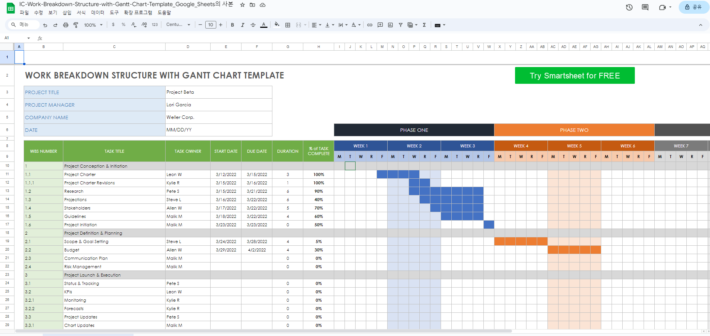

[위키사진](https://ko.wikipedia.org/wiki/%EC%97%85%EB%AC%B4_%EB%B6%84%EC%97%85_%EA%B5%AC%EC%A1%B0)


[WBS](https://ko.wikipedia.org/wiki/%EC%97%85%EB%AC%B4_%EB%B6%84%EC%97%85_%EA%B5%AC%EC%A1%B0)는 프로젝트 진행에 있어서 핵심적인 관리와 소통 도구이다.
WBS는 모든 업무에서 사용할 정도로 광범위한 프로젝트 관리 기법이다. 
대체적으로 현장에서는 `WBS와 issue tracking 시스템을 병행`하면서 사용한다.  

- issue tracking 시스템은 업무처리에 중점
- WBS는 목표관리에 중점

[🤖 Bard에게 물어본 WBS](images/bard_0.jpg)

##### 👀 현업에서 두 개를 분리해서 사용하는 이유
~~~
WBS는 워터폴, issue tracking은 에자일
대부분의 프로젝트는 두 개를 병행 또는 혼합하며 
진행한다.
~~~

## 1. WBS(작업 분해도)란

`WBS는 Work Breakdown Structure의 약자`
`R&R(Role and Responsibilities)을 기반으로 한 업무관리`

- 프로젝트 관리에서 사용되는 중요한 도구 
- 프로젝트의 작업을 세분화, 조직화
- 가능한 요소로 분해하는 방법

다음 단계의 내용을 포함해야 한다.


WBS를 사용하는 사람들은 다음과 같다.

```python
1. "PM" : WBS를 취합하여 관리한다.
2. "프로젝트 팀원": 자신에게 할당된 업무를 기간별 기록한다.
3. "🍺😵‍💫 이해 당사자" : WBS를 보고 판단한다(대표, 임원, 고객사,...)
```
## 2. WBS 특징
 
1. **작업 분해:**  
	1. 프로젝트의 단위 별 세분화 
	2. 복잡한 작업을 관리 가능한 수준으로 분해
	3. 관리 및 추적 용이 
2. **계층 구조:**  
	1. 계층적인 구조
	2. 상위 수준의 작업을 하위 수준의 작업으로 분해 
3. **범위 정의:**  
	1. 범위를 명확하게 정의
	2. 작업 간의 연결을 시각적 표시 
4. **자원 할당:**  
	1. 작업의 책임을 명확히 할당 
	2. 단위 별 자원 관리 

WBS는 프로젝트 관리자와 팀원들이 프로젝트를 이해하고 관리할 수 있도록 도와주는 강력한 도구이다. 이를 통해 `(1)작업의 우선순위`를 파악하고 작업 간의 `(2)종속성을 이해`할 수 있으며, `(3)일정 및 예산 관리`하고 최종 목적은 `(4)리소스를 최적화`하는 것이다.

#TODO 
##### 여기서 질문!
> 🙋🏾‍♀️🙋🏾‍♂️ 
> 일의 순서를 보면
> WBS가 먼저일까? 
> Issue tracking Sytem이 먼저일까?
```
[TODO] 각자가 생각하는 결과는?
```


#TODO
### Ask 생성AI

🤖프롬프트 : "일의 순서를 보면 WBS가 먼저일까?  Issue tracking Sytem이 먼저일까?"

```
[TODO] 생성AI 결과는?
```

## 2. WBS의 장단점

| 항목 | 내용 |
| ---- | ---- |
| 장점 | **작업 분해:**  WBS는 프로젝트를 더 작고 관리 가능한 작업 단위로 분해하여 이를 통해 프로젝트 관리자와 팀원들이 전체 프로젝트를 이해하고 관리할 수 있다. |
|  | **범위 정의:**  프로젝트의 범위를 명확하게 정의, 시각적으로 표시하여 프로젝트 범위 관리 |
|  | **일정 및 리소스 관리:**  각 작업에 대한 일정, 비용 및 리소스를 추적하고 관리하기에 자원관리(인력, 시간) 가능.  |
|  | **의사소통:**  한 눈에 볼 수 있는 항목으로 서로 소통 |

| 항목 | 내용 |
| ---- | ---- |
| 단점 | **과도한 세부화:**  너무 많은 세부 작업으로 나누면 오히려 관리가 복잡해진다. 추적이 힘들어진다.  |
|  | **오분류 및 중복:**  task를 잘못 분류하거나 중복 작업을 만들어낸다. 비효율이 발생한다.  |
|  | **유연성 부족:**  변경사항이 발생할 경우, 초기에 만들어진 WBS가 맞지 않게 된다. 유연성이 떨어진다.   |
|  | **의사 결정과 시간 지연:**  WBS는 단순한 문서이므로 의사결정이 느려진다.   |
## 3. WBS 작성 시 필요 항목
WBS는 다양한 포맷이 있다.그러나 다음 항목들은 포함되어 있어야 한다. 프로젝트의 목적과 제목은 필수로 기재한다. 참고로 `task`는 작업의 단위이다. 그리고 task의 넘버링은 순서가 아니다. 단지 현장에서는 순서처럼 느껴지게 사용할 때가 있다. 


1. **task:** 할 일(task) 항목은 3단계를 넘지 않는다. 넘버링은 논리적으로 하는 것을 권장한다.
	1. **수준 1 작업 task:**  가장 큰 분류 
	2. **수준 2 작업 task:**  중간 단계 분류
	3. **수준 3 이하의 작업 task:**  3단계 이하를 사용하지 않는 것이 일반적 
~~~
1. 프로젝트
    1.1 단계 1
        1.1.1 작업 1
        1.1.2 작업 2
    1.2 단계 2
        1.2.1 작업 3
        1.2.2 작업 4
    1.3 단계 3
        1.3.1 작업 5
        1.3.2 작업 6
~~~
2. **식별 번호 또는 코드**: `추적 가능한 것`으로 하는 것을 권장한다. 번호와 코드 모두 사용된다.
3. **일정(Gantt)**: 일정은 시작과 종료를 의미한다.  투입된 시간을 정량적으로 도식화 한다.
4. **목표와 진행율**:  목표에 대한 간략한 정의. 진행에 대한 정량적 수치를 표시한다.
5. **담당자:** 담당자가 진행 상황에 대해 confirm 한다.


#TODO
##### 여기서 질문!
> 🙋🏾‍♀️🙋🏾‍♂️ 
> WBS에서 진척률은 어떻게 구하는가? 정확할 수 있는가?
```
[TODO] 각자가 생각하는 결과는?
```

### Ask 생성AI

🤖프롬프트 : "WBS에서 진척률은 어떻게 구하는가? 정확할 수 있는가?"

```
[TODO] 생성AI 결과는?
```

## 4. WBS 작성하기 
> 팀에서 기획한 프로젝트를 대상으로 WBS 대략 만들기 

만약 Excel이 없다면?:
- [Libre office 다운로드](https://www.libreoffice.org/download/download-libreoffice/)
- Linux, Windows, macOS에서 사용하는 Free 소프트웨어
- MS Office 의 대부분 기능과 호환

사용 템플릿:
- [wbs_template.xlsx 파일](data/wbs_template.xlsx)

PM 업무에서 아쉬운 Excel(=GoogleSheet, LibreOffice) 지식:
- [WBS를 위한 조건부 서식](https://www.google.com/search?q=WBS%EB%A5%BC+%EC%9C%84%ED%95%9C+%EC%A1%B0%EA%B1%B4%EB%B6%80+%EC%84%9C%EC%8B%9D&oq=WBS%EB%A5%BC+%EC%9C%84%ED%95%9C+%EC%A1%B0%EA%B1%B4%EB%B6%80+%EC%84%9C%EC%8B%9D&gs_lcrp=EgZjaHJvbWUyBggAEEUYOdIBCDQ1MjRqMGo3qAIAsAIA&sourceid=chrome&ie=UTF-8#ip=1)
- ✒[Excel 조건부 서식과 조건문 정리](4.1_Excel_조건문_서식.md)📕
- ✒[Google Sheet 조건부 서식과 조건문 정리](4.2_GoogleSheet_조건문_서식.md)📕
- ✒[Libre Office 조건부 서식과 조건문 정리](4.3_LibreOffice_조건문_서식.md)📕

고려사항:
1. 디자인은 외부업체를 선정한다. 
2. 개발은 외부업체를 선정한다.

미션:
~~~python
1. "진행율"을 제외한 모든 것을 만든다
2. 1 단계  ->  1시간 
3. 2 단계  ->  1시간 리뷰
4. 3 단계  ->  외부업체 WBS 채워넣기
~~~


[Google Sheet로 만드는 WBS ](https://workspace.google.com/marketplace/app/projectsheet_planning/1080532206233)
<iframe width="560" height="315" src="https://www.youtube.com/embed/YO3jdYZIYaY?si=SPtSekenPnBic8Hb" title="YouTube video player" frameborder="0" allow="accelerometer; autoplay; clipboard-write; encrypted-media; gyroscope; picture-in-picture; web-share" allowfullscreen></iframe>

#TODO
##### 여기서 질문!
> 🙋🏾‍♀️🙋🏾‍♂️ 
> WBS 문서에서 시간이 지나감에 따라 양식이 지켜지지 않는 이유 
```
[TODO] 각자가 생각하는 결과는?
```

## 5. WBS와 Issue Tracking System 
> 왜? 대부분의 프로젝트에서는 같이 사용할까? 

Person(🙋🏾‍♀️🙋🏾‍♂️): 
- WBS와 issue Tracking System을 같이 사용하는 이유

ChatGPT(🤖): 
- Work Breakdown Structure (WBS)와 Issue Tracking System은 프로젝트 관리에서 중요한 도구입니다. 이 두 가지를 같이 사용하는 이유는 다음과 같습니다: 

1. 작업 관리와 추적: WBS는 프로젝트를 작은 단위로 분해하여 작업을 계층적으로 구조화합니다. 이를 통해 프로젝트의 범위를 이해하고 관리할 수 있습니다. Issue Tracking System은 프로젝트 진행 중 발생하는 문제, 결함 또는 변경 사항을 추적하고 해결합니다. WBS는 작업을 정의하고, Issue Tracking System은 작업 수행 중 발생하는 문제를 추적하여 해결합니다. 
2. 프로젝트 진행 상황 파악: WBS는 프로젝트 작업을 시각적으로 표현하여 각 작업의 진행 상황을 추적하고 모니터링할 수 있게 합니다. Issue Tracking System은 발생한 문제의 상태와 해결 과정을 추적하여 어떤 문제가 해결되고 있는지, 어떤 문제가 남아 있는지 파악할 수 있습니다. 
3. 통합된 관리: WBS와 Issue Tracking System을 함께 사용함으로써, 프로젝트의 전반적인 관리를 통합하고 조율할 수 있습니다. WBS를 기반으로 한 작업들이 Issue Tracking System에서 발생하는 문제들과 어떻게 연관되는지 이해하고 관리할 수 있습니다. 
4. 의사 소통 및 협업: WBS는 프로젝트 구성원들 간의 작업 분담과 할당을 명확하게 하여 효율적인 협업을 가능하게 합니다. Issue Tracking System은 발생한 문제를 관련자들에게 할당하고 해결하는 데 도움이 되며, 팀 간의 의사 소통과 협업을 촉진합니다.

따라서, WBS와 Issue Tracking System을 함께 사용하면 프로젝트 관리의 효율성을 높이고, 작업 관리와 문제 해결을 통합적으로 수행할 수 있습니다.

##### 현업의 짧은 정리 
~~~Javascript
"WBS"는 -> "한눈에 보고 싶어하는 책임자"를 위한 문서
"issue tracking System"은 -> "issue를 철저히 관리하고자 하는 프로젝트 매니저"를 
위한 소프트웨어(==issue 디버깅시스템)
~~~
