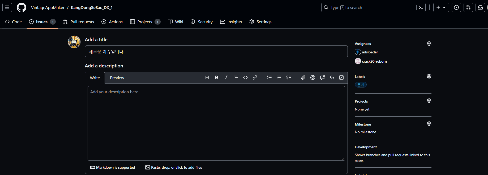
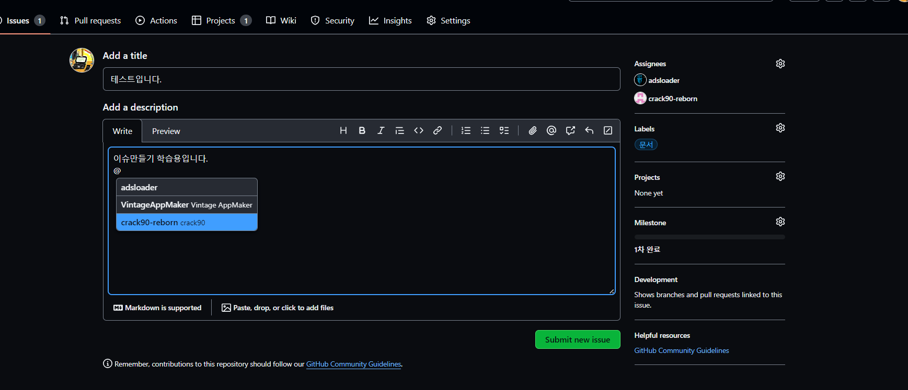
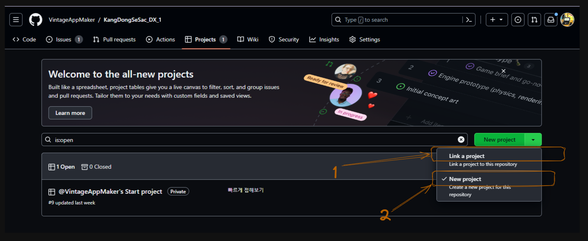

# 1. github을 이용한 issue 관리
> issue 관리툴 중에 Opensource 진영에서 가장 많이 사용되는 것이 github이다. github은 자신의 저작물을 오픈소스로 배포하는 용도로 사용하지만, co-work을 하며 issue가 발생했을 때 정보를 공유하는 툴로도 사용하고 있다.

## 1.1 repository에 issue 만들기
issue tracking 시스템은 다양한 방법으로 사용할 수 있다. 그렇지만 학습을 위해 다음과 같이 제한된 방법을 사용하도록 한다. 

1. **사용자 추가 및 제한설정:**
    - 협업자 추가 및 관리:
	    ~~~mermaid
	    flowchart TD
	    
	    A[Owner가 레포지토리 생성] --> B[Settings]
	    B --> C[Collaborators]
	    C --> D[Add peoples]
	    D --> |검색 후| E[collaborator 권한설정 후 추가] 
	    
	    ~~~
	    - 
	    - `owner와 collaborator`를 구분 
	    - issue를 함부로 변경하지 못하게 하기 위함
    - 추가 시 제한설정:
	    - `collaborator`는 read only로 관리자에게 상태요청만 가능하도록 한다. 
2. **issue 등록을 위한 설정:**
    - issues 메뉴에서 중간에 `labels`, `Milestones` 탭이 존재한다. 이것을 누르면 수정 가능하다. 
    - `labels`: 이슈의 성향을 설명하는 tag와 같은 존재
    - 
	    - 1 -> Label을 추가한다.
	    - 2 -> 추가된 Label을 수정, 삭제한다.
    - `milestones`: 이정표. 
    - 
	    - 언제까지에 대한 일정을 지정함.
	    - 추가/수정/삭제 가능
	    - `milestones가 지정된 issue가 존재할 수도 있다`이다.
3. **issue 등록(owner):**
    - issue 생성:  issues 탭에서 new issue 버튼을 눌러서 새롭게 issue를 작성한다.
	    - 
    - 담당자 할당(권장): issue의 담당자를 할당한다. 
	    - 
    - labels 설정(권장): issue의 성격을 지정된 Label로 설정한다.
	    - 
    - milestones 설정(옵션): milestone 안에 해결할 issue라면 등록한다.
	    - 
 1. **issue 요청 및 관리:**
    - issue 등록 및 처리요청: 최초 issue 등록은 submit new issue 버튼을 눌러 등록한다.  등록시에는 이슈에 대한 간략한 설명 및 담당자를 할당하고 @로 담당자에게 멘션을 걸어 알려준다. 이에 멘션을 받은 사람은 피드백을 이슈   
	    - 
    - issue 진행상황 기록: 이슈에 대한 모든 작성글을 Timleline 기반으로 Thread로 저장된다. 그러므로 누가 무엇을 했는 지 추적이 가능하다.
	    - 
    - issue closed: issue를 closed하는 것은 매우 중요한 일이므로 Owner의 허락을 받아야 한다. 가끔 이런 이유로 분쟁이 생긴다.
	    - 
    - issue reopen: Owner가 agree 하지 못한다면 issue는 재오픈 되는 것이 일반적이다.
	    - 
## 1.2 issue를 project에 등록하기
project 내에서 issue를 생성할 수도 있지만, 학습을 위해서 생성된 issue를 project에서 가져오는 방법을 사용한다.

5. **projects 생성:**
    - repository 기준으로 생성:
    - 
	    - 1 -> Link a project: 기존의 프로젝트를 지금 repository와 연결
	    - 2 -> New project: 지금 repository에 **새롭게 Project**를 만들고 연결
1. **Template 선택:**
    - 새롭게 프로젝트를 만든다는 가정하
    - Create project  화면에서 Teamplate로 "Team planning" 선택
    - 
	- Project의 새로운 이름 지정
	-  
	- Create project 버튼을 누르면 다음과 같이 생성된 화면으로 이동
	- 
1. **설정하기:**
    - 설정으로 이동:
    - 
    - 
	    - project settings: 프로젝트의 이름과 설명을 지정한다.
	    - manage access: 프로젝트의 성격, 사용자 추가/삭제를 한다.
		    - owner는 Role을 Admin으로 지정
		    - 나머지 팀원들은 Role을 Read로 설정 
	    - status: 프로젝트 관리에서 사용하는 상태의 항목으로 Status를 정리한다. 
	    - priority:  프로젝트에서 관리하는 우선순위로 재지정한다. 
2. **project에서 board issue:**
    - issue 추가하기:
    - 
	    - '#' 을 눌러 issue가 포함된 repository 선택
	    - repository에서 issue 선택
	    - 추가된 issue는 `수정 가능하며 Drag & Drop으로 Card(Status) 변경`이 가능하다. 
    - Board 설명: 
	    - `backlog`: 대부분의 모든 issue 
	    - `Team capacity`: 팀에게 할당된 내용
	    - `Roadmap`: milestone 기준으로 timeline 형식으로 issue
	    - `My items` : 나에게 할당된 내용
    - Insights: 
	    - issue의 상태를 Graph로 볼 수 있다(report).
	    - 권한이 Admin인 경우만 사용 가능하다. 
	    - 

# 2. Team별  issue 처리 - 미션
 현업에서 쏟아지는 issue들은 반드시 처리해야 한다는 자세로 임해야 하지만 일정 내에 처리되는 경우는 흔치 않다. 그 만큼 **감당할 수 없는 issue가 발생하고 이로 인한 협의**가 이루어지게 된다.  다음의 issue는 **팀에서 한 명이 자신의 repository로 생성하고 나머지 팀원들을 collaborator로 등록하며 issue를 처리**하도록 한다.

 
#TODO

- 쇼핑몰 서비스를 웹과 앱으로 만든다.
    - [ ] 앱에서 알림이 안오고 있다? 누구에게 물어볼 것인가?
    - [ ] 잘못된 정보가 보이고 있다. 누구에게 물어볼 것인가?
    - [ ] 서비스 전반의 사용자 및 매출 리포트가 필요하다. 1회성일 때와 상시일 때를 구분한 후, 누구에게 물어볼 것인 지 설명하기
    - [ ] 과금이 안된다. 누구에게 물어보아야 하는가?
    - [ ] 데스크탑에서 트래픽양이 많다. 누구에게 물어보아야 하는가?
    - [ ] 모바일 엡에서 트래픽양이 많다. 누구에게 물어보아야 하는가?
- 우리 프로젝트에 필요한 사람은 내부인력 또는 외부인력?
    - [ ] 회사 내부에 개발자가 쥬니어 개발자이다. 어떻게 개발해야 할까?
    - [ ] 외주개발조직을 어떻게 관리해야 하는가? Agile? 워터폴?
- 이슈 트래킹 시스템 사용
    - [ ] 이슈를 클리어하지 못하는 팀원들이 있다. 어떻게 해야 하는가?
    - [ ] 기술적으로 클리어 할 수 없는 이슈가 있다. 어떻게 해야 하는가?
    - [ ] 팀원들이 이슈 트래킹 시스템에 익숙하지 않다. 어떻게 해야 하는가?
    - [ ] 기획쪽에서 의도적으로 기능을 추가하려고 한다. 어떻게 해야 하는가? 외부과제와 내부과제에서 행동은 어떻게 달라지는가?
    - [ ] 프로젝트 지연에 대해 최종 결정자인 임원과 대표가 관심이 없다. 이럴 경우, 가장 먼저 해야할 일은?

#TODO
- 메뉴트리
    - [ ]  메뉴트리는 무엇인가?
    - [ ] 가로로 하는 것이 좋은가? 세로로 하는 것이 좋은가?
- 개발회사에게 전달해야 하는 기획내용은?
    - [ ] 어떤 내용을 포함하고 있어야 하는가?
    - [ ] 어떤 내용을 포함하지 말아야 하는가?
- 프로젝트를 시작하려면 무엇부터 해야하는가?
    - [ ] 기획은 어떻게 관리하는가?
    - [ ] 팀빌딩 방법은?
    - [ ] R&R은 어떻게 하나?
- 팀빌딩을 할 때 고민해야 할 것은?
    - [ ] 과제에 맞는 개발자는 어떤 식으로 구할 수 있나?
    - [ ] 과제에 맞는 기획자는 어떤 식으로 구할 수 있나?
    - [ ] 과제에 맞는 디자이너는 어떤 식으로 구할 수 있나?
- 개발자의 안되요
    - [ ] 경력개발자일 수록 안되요를 많이하는 이유
    - [ ] 신입일 수록 되요를 많이하는 이유

#TODO 
- MVP
    - [ ] 기술의 부채란?
    - [ ] mvp의 장점과 단점은?
    - [ ] 왜 스타트업 기획자는 mvp를 선호할까?
- 웹과앱은 기획을 달리 하는가?
    - [ ] 웹기획과 웹기획의 차이점
    - [ ] 무엇부터 먼저해야 하는가?
- 디자인
    - [ ] 데스크탑, Android, iOS가 다른가?
        - [ ] dp와 pt의 차이점과 사용이유
    - [ ] 이미지 크기가 중요한가요?
        - [ ] 제한크기는?
        - [ ] OS에 따라 달라져야 하는가? 이유는?
    - [ ] png와 jpg, webp, svg의 차이점은?
    - [ ] 개발자와 협업은 실시간이어야 하는가?
        - [ ] 앱개발자가 디자이너에게 웹기준으로 디자인 했다고 크레임을 걸었다. 해결방법은?
        - [ ] 안드로이드 앱개발자가 디자이너에게 iOS 기준으로 디자인 했다고 크레임을 걸었다. 해결방법은?
        - [ ] 앱개발자가 디자이너에게 이미지를 통자로 넣었다고 크레임을 걸었다. 해결방법은?
- 웹
    - [ ] 웹은 누가누가 만드나?
    - [ ] 웹을 만드는 개발 도구와 언어들은? 어떻게 선택해야 하는가?
    - [ ] 우리가 제작하는 서비스 홈페이지에 로그인이 안된다? 누구에게 물어보나?
    - [ ] 우리가 제작하는 서비스 홈페이지에 브라우저로 접속이 안된다. 누구에게 물어보아야 하나?
    - [ ] 우리가 제작하는 서비스 홈페이지 이미지가 깨져보인다. 누구에게 물어보아야 하나?
    - [ ] 우리가 제작하는 서비스 홈페이지에 모바일 환경과 데스크 탑에서 성능이 다르다. 누구에게 물어보아야 하는가?
- 앱
    - [ ] 쇼핑몰 앱을 만들 때 어떤 인력들이 필요한가?
    - [ ] 문제없던 앱이 마켓에서 사라졌다. 이유와 대처방안은?
    - [ ] 앱을 만드는 개발 도구와 언어들은? 어떻게 선택해야 하는가?
    - [ ] 이전에 잘돌아가고 문제없던 소스가 이제는 안된다고 한다. 이유는?