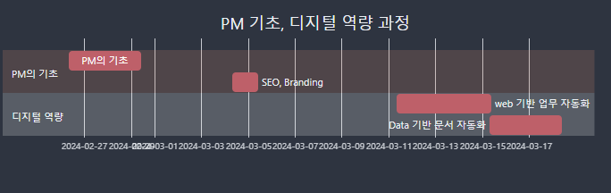

# Road To PM

> PM으로 가는 길

---
# PM은 

👩🏾‍💻모든 것을 알아야 한다 🚧
 

<marquee>PM은 이슈를 판단하고 목표를 선택하고  일정을 관리하는 사람이기 때문</marquee>

---
##  PM이 하면 안되는 것!

"PM : 난 모르는 분야입니다. 모르겠어요"

~~~
사람들 반응:
👧🏾👨🏾🎃🦊😟
~~~
#### 어쩌라고?

---

# PM에게 필요한 것 

~~~mermaid
flowchart LR

A["프로젝트 이슈판단을 위해 \n\n"] --> |필요함\n\n| B["모든 과정을 이해하는 능력\n\n"]
~~~
~~~mermaid
flowchart LR

A["소통과 진행을 위해 \n\n"] --> |필요함\n\n| B["철저한 문서작성 능력\n\n"]
~~~
---
# 필요한 학습

- 문서의 과도한 분량 → 자동화  
- 다양한 자료 → Software 능력
- 이슈관리 → 팀별 업무 및 Process 이해
- 업무관리 → 소통방법

---
# 디지털 역량이란?

~~~
디지털 역량은 
디지털 사회에서 주어진 문제를 해결하기 위해 
다른 사람과의 [협업과 소통]을 통해 
[디지털 기술을 활용]하여 
필요한 정보를 탐색하고 분석하여 
[결과물을 생산]하는 능력을 의미한다.
~~~

---

# RoadMap

---
# Section

---

# 디지털 역량 강화방법

- 필수 기초만 학습 후(매뉴얼 따라하기) 
- 주어진 mission을 `자력갱생`으로 해결
- 자료정리 후, 꾸준히 업그레이드 
- 주어진 시간 안에 해결하는 습관 체화

---
## PBL은 "Problem-Based Learning" 
> 기획의 강의법인 PBL을 변형하여 진행
---

1. **문제 중심 학습 (Problem-Centered Learning):** 
	- PBL은 참여자들이 실제 세계에서 나타나는 복잡한 문제에 직면하고 해결하는 과정을 강조
	- 참여자들은 주어진 문제를 해결하기 위해 팀으로 협력하며 학습

---

2. **협업과 팀 프로젝트 (Collaboration and Team Projects):** 
	- PBL은 학생들이 팀을 이루어 협력하여 문제를 해결
	- 팀원 간의 의사소통과 협업 능력을 강화, 공동 작업 

---

3. **평가와 피드백 (Assessment and Feedback):** 
	- PBL에서는 학습 과정과 결과를 평가하고 피드백
	
