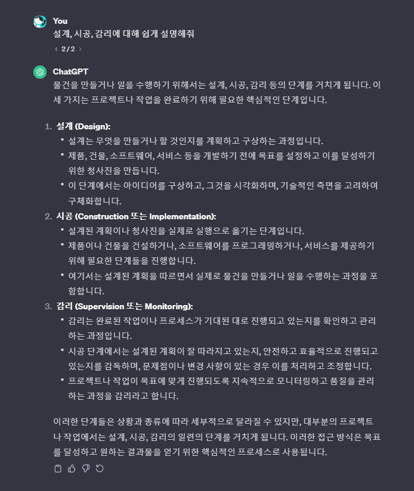
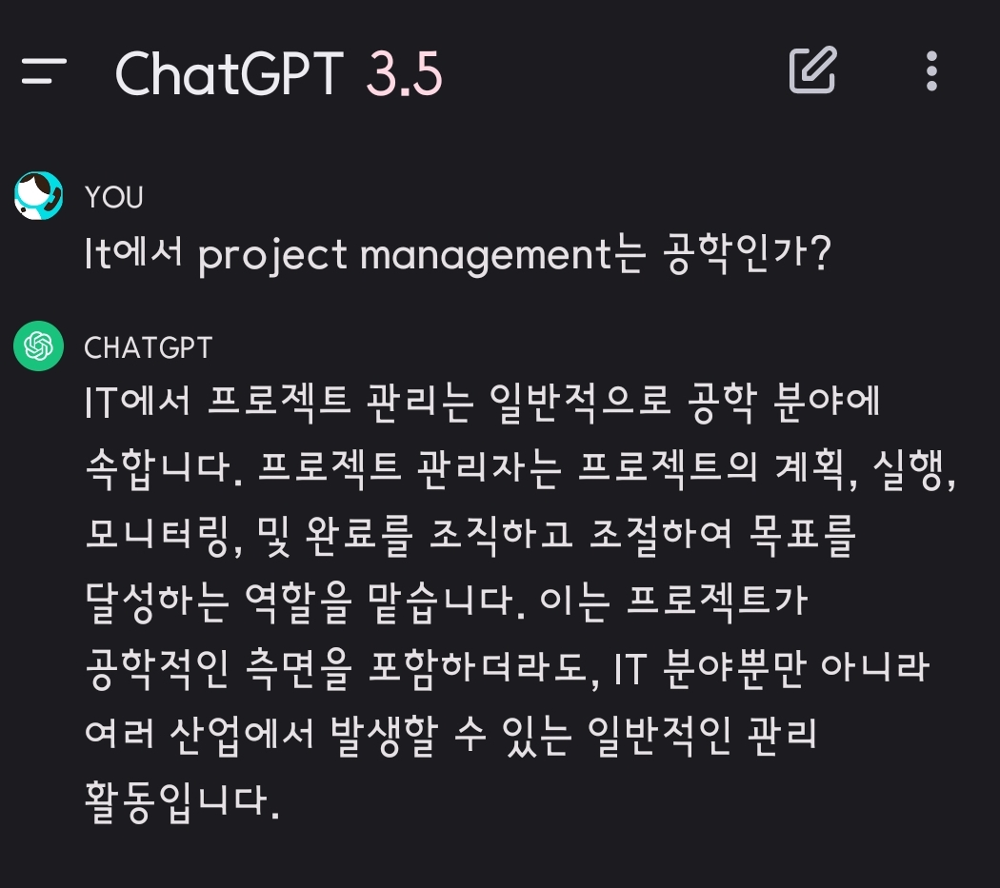
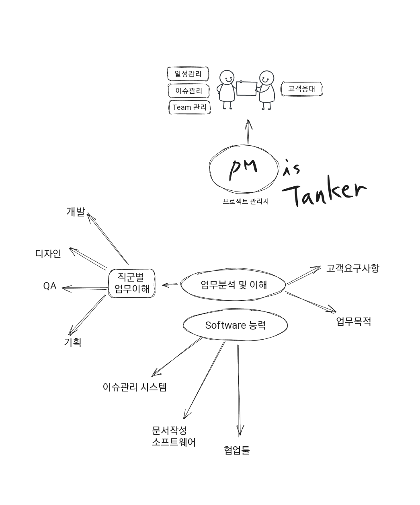
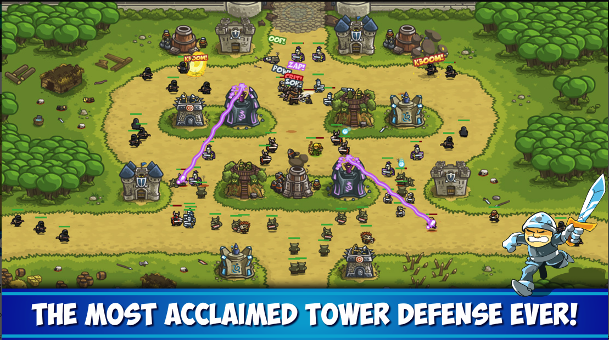
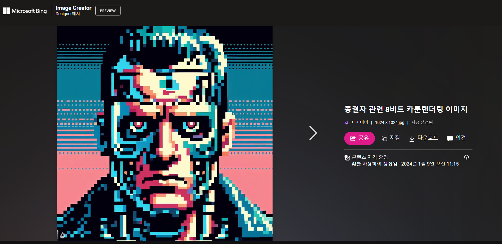
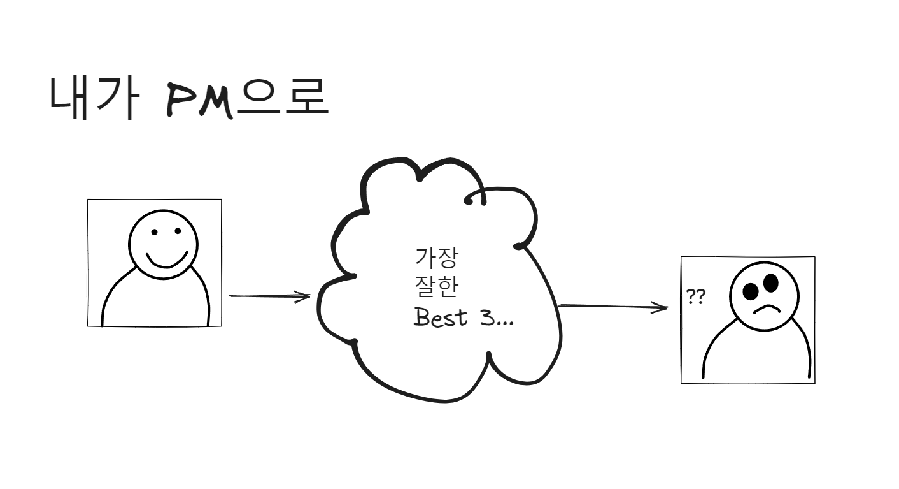

# 프로젝트의 상식

#### Project Management는 시공이다. 


#### 대기업조차 
`우리 회사 것보다 남의 회사 것`을 하는 비중이 크다(B2B의 비중이 크기 때문이다). 
- 그런 점에서 프로젝트는 `투명화된 표준화 방법론`으로 진행해야 한다.  
- 그렇기에 PM과 프로젝트 관리 솔루션은 필수가 된다. 
# 1.PM이란



## 1. PM이란 

> 프로젝트를 성공으로 이끄는 사람이다. 

~~~
현업이 말하는 PM: 
- 가장 힘든 일을 하는 직군
- 팀 구성원들의 업무를 이해 못하면 프로젝트가 망한다
- 멀티 플레이어가 요구됨
- PM의 핵심 역량은 `판단력` 이다  
~~~


~~~mermaid

flowchart TD

A["project 시작"]-->B["프로젝트 진행"]
B-->C
C{"PM이 무능력하면"}--> |Y| D[프로젝트를 완료시키지 못함]
D-->B
C--> |N| E[프로젝트 완료]


~~~

pm의 역할은   issue의  wave 를 defense하는 것이다. 

`심지어 "계약일정"까지 고려하며` 일을 관리(진행, 멈춤)한다. 




#TODO 
### Ask 생성AI
🤖프롬프트 : "Project manager의 정의"
~~~
[TODO] 생성AI 결과는?
~~~

## 2. PM의 업무

```
현업이 생각하는 PM의 임무: 
- 교통정리 (이슈관리)
- 일정관리 (Bottleneck을 방지하며 일정대로 진행)
- 정보공유(진행상황에 대한 정보공유 및 책임)  
```

#### PM의 업무분포
~~~mermaid
pie
"R&R" : 30
"일정관리" : 30
"협의" : 40
~~~

#TODO 
##### 여기서 질문!
> 🙋🏾‍♀️🙋🏾‍♂️ 
 다음 중 PM의 업무가 아닌 것은?

- [ ] 일정관리
- [ ] 문서관리 취합
- [ ] 이슈 / 히스토리 관리
- [ ] 업무할당
- [ ] 고객사 협의
- [ ] 법률 검토 
- [ ] 특허진행
- [ ] 특허출원
- [ ] 계약진행
- [ ] 계약진행 관리

  
```
[TODO] 각자가 생각하는 결과는?
```

### Ask 생성AI
🤖프롬프트 : "PM의 업무는?"
~~~
[TODO] 생성AI 결과는?
~~~

## 3. PM의 역량 

```
현업 동료들이 말하는 PM의 역량: 
- 팀 프로젝트에 대한 문해력 (기초지식)
- 이슈관리 프로그램 능력 (jira, trello, wbs 작성관리)
- Software 문해력(프로그래밍, 파워유저)  
```

##### 프로젝트 담당자가 말하는 PM의 필수역량
- 문서의 과도한 분량 → 자동화  
- 다양한 자료 → Software 능력
- 이슈관리 → 팀별 업무 및 Process 이해
- 업무관리 → 소통방법

#TODO
### Ask 생성AI

🤖프롬프트 : "PM의 역량은?"
~~~
[TODO] 생성AI 결과는?
~~~


#TODO
### Ask 생성AI

🤖프롬프트 : "개발자 출신 PM과 기획자 출신 PM 중 누가 효율적인가? "
~~~
[TODO] 생성AI 결과는?
~~~

## 4. PM의 도구
> PM의 실질 업무에서 필요한 소프트웨어는 다음과 같이 분류할 수 있다. 단, 회사의 성격과 업무에 따라 소프트웨어는 달라지기도 한다. 

1. **프로젝트 관리 도구 (Project Management Tools):**
    - **Jira:** 이슈 추적, 작업 관리, 프로젝트 추적 및 보고서 작성을 위한 강력한 도구
    - **Asana:** 업무 관리, 할일 목록 및 프로젝트 추적을 위한 협업 도구
    - **Trello:** 칸반 보드 형식의 작업 관리를 위한 직관적인 도구
    - **github projects:** 기술베이스의 플로젝트 및 이슈관리 
1. **팀 협업 도구 (Team Collaboration Tools):**
    - **Slack:** 실시간 메시징 및 채널 기반의 팀 커뮤니케이션을 지원
    - **Jandi, Naver works:** 비디오 회의, 문서 공유, 협업 기능 
2. **문서 및 파일 공유 도구 (Document and File Sharing Tools):**
    - **Google Drive, Dropbox, OneDrive:** 파일 공유, 협업 문서 편집 및 저장을 위한 클라우드 
3. **일정 관리 도구 (Scheduling Tools):**
    - **Microsoft Project:** 복잡한 프로젝트 일정 관리, 리소스 할당 및 작업 추적
    - **Excel, GoogleSheet:** WBS 작성
4. **버전 관리 및 형상 관리 도구 (Version Control and Configuration Management Tools):**
    - **Git (GitHub, GitLab, Bitbucket):** 코드 관리, 버전 관리, 협업을 위한 소프트웨어


## 5. PM에 대한 사설
> PM 업무는 생각보다 변수가 많다. 

#### 무엇이었을까?

