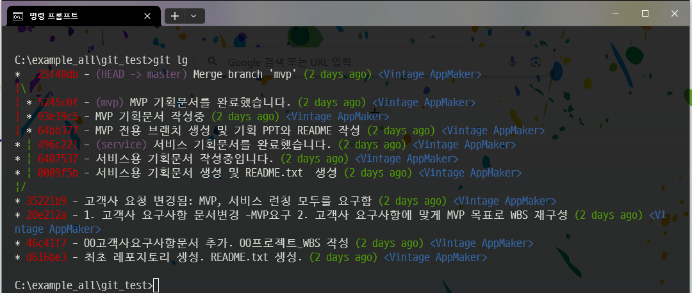

# Git 상식 및 생존 커맨드 

크게 3개의 영역이 있음.

- 작업 영역(Working directory)
- 수정된 영역(Staging Area)
- git 저장소(repository)

|   |   |   |
|---|---|---|
|working directory|staging Area|repository|
|git으로 지정된 물리적인 작업저장소|git commit으로 올라갈 수정된 정보가 있는 파일영역|commit으로 올려진 .git의 저장소(파일, DB정보, 등등)|
|파일작업|add/rm/restore 등등으로 정보변경|commit/reset/checkout/branch 등등으로 변경|


출처([https://git-scm.com/book/en/v2/images/areas.png](https://git-scm.com/book/en/v2/images/areas.png))

|   |   |
|---|---|
|branch|어느시점에 자료덩어리가 복사되어 다른이름으로 관리되는 것. branch간에 이동(checkout)이 가능하기에 강력하게 사용할 수 있다.|
|head|현재 작업중인 branch|


## 참고
> 아래 명령어는 DOS(터미널)에서 실행하는 커맨드로 개발자들에게는 가장 편리한 방법이다.그러나 기획자들에게는 절대로 추천하지 않는다. SourceTree라는 훌륭한 Software가 존재한다.

`sourcetree를 사용하다가 관심이 생기면 아래 커맨드를 사용해보기를 추천함`

---

### git 필수명령어

반드시 사용할 수 밖에 없는 필수 커맨드

- 커맨드설명

|   |   |
|---|---|
|git log|로그를 출력한다.|
|git status|최신상태를 출력한다|
|git add/rm|자료를 등록/삭제 → stagging 대상. 로컬임|
|git commit|자료를 커밋한다 → repository에 등록. 로컬임|
|git push|local 저장소 → git 서버|
|git pull|git 서버 → 로컬 저장소|

- git 레포지토리 설정하기

```
1. 폴더이동
2. git init
3. git add .
4. git commit -m "메시지"
```

- 파일추가 및 적용 (add)

working directory에서 staging으로 파일 추가할 경우 사용함. 여기서 추가는 파일이 수정된 모든 경우(추가, 삭제, 수정) 를 말함. **commit**을 하기 전에 관용적으로 빈번하게 사용함.

```
1. git add 파일명 : (.)는 전체파일
2. git commit -m "메시지"
```

- 파일삭제 (rm)

지정된 파일을 삭제. --cached 옵션을 주지않는다면 working directory에 있는 파일까지 삭제함

```
1. git rm 파일명 (로컬파일, git 파일 모두삭제)
2. git rm --cached 파일명 (git 저장소에서만 삭제)
```

- 파일 되돌리기

rm으로 삭제된 파일 복구하기

```
 
1. git log ( 이전기록보기 ) 
2. git reset <version> (version 으로 이동 )
3. git checkout -- 파일경로(삭제한 파일 가져오기 ) 
4. git commit -m "Fix" 파일경로(다시커밋) 

(*) push할 경우,  git push -f

```

- 최근 커밋을 수정하고 싶을 때

최신 커밋에서 파일을 누락했거나 메시지가 잘못되었을 경우, --amend를 사용함.

```
1. add/rm 등등 사용가능
2. git commit --amend -m "원하는 메시지"
```

- 한 번에 stage 상태나 commit을 되돌리기 

```
1. stage에 올라간 파일 모두 취소
git reset HEAD

2. 최신 commit 취소하기(unstage상태)
git reset HEAD~1

3. 최신 commit 취소하기(stage상태)
git reset --soft HEAD~1
```

- 브랜치 만들고 이동하기

새로운 버전관리를 위해 branch를 만들고 이동해야 할 때, branch와 checkout을 사용한다. -d 옵션을 주면 삭제된다.

```
 
1. git branch [브랜치이름] 
2. git checkout [브랜치이름]

3. git add .
4. git commit -m "브랜치 추가"

```


 checkout 명령은 브랜치 이동 외에도 커밋간의 이동도 가능하다. 

- 브랜치 합치기

수정한 브랜치를 메인브랜치에 합치고자 한다면 checkout과 merge를 사용한다.

```
 
1. git checkout [메인 브랜치이름] 
2. git merge    [합칠 브랜치이름]

```

- 원격저장소 연결

git 서버와 연결하기 위한 커맨드

```
git remote add origin (원격 저장소 github URL)
```

- git 초기화 하기

```
1. .git 폴더 완전삭제
2. git init
3. git add .
4. git commit -m "최초커밋"

원격저장소로 연결하고자 한다면
git remote add origin [repo_address]
```

-  git log  검색

1. 커밋 메시지에서 문자찾기 
2. 파일내용(text)에서 메시지 찾기

~~~
1. git log --oneline --grep [단어] 
2. git log --oneline -G[단어]
~~~

- 기타 - git log를 colorful 하게 만들기 

~~~
git config --global alias.lg "log --color --graph --pretty=format:'%Cred%h%Creset -%C(magenta)%d%Creset %s %Cgreen(%cr) %C(blue)<%an>%Creset' --abbrev-commit"
~~~

alias로 lg를 주었다. 그러므로  git lg를 하면 log를 colorful하게 볼 수 있다. 

