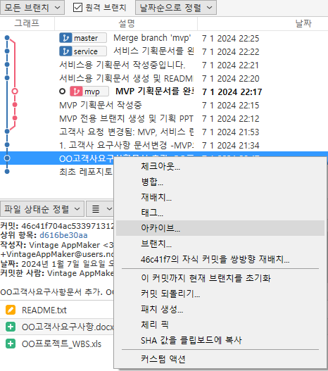
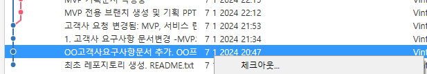
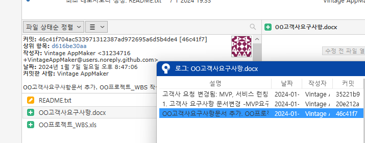
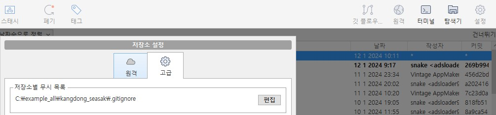
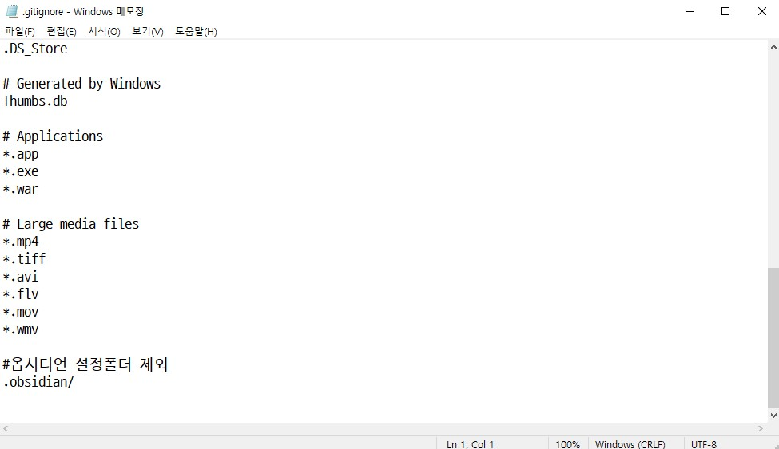

# SourceTree 참고사항
> 기본적으로 자주 사용하는 기능을 설명

# 1.  이전 commit 자료 가져오기 

`방법 1 `: 좌측 히스토리 메뉴를 클릭하고, 원하는 commit을 클릭한 다음, 아카이브를 누르면 해당 커밋의 내용을 zip으로 압축저장한다.

`방법 2 `: 좌측 히스토리 메뉴를 클릭하고, 원하는 commit을 클릭한 다음, 체크아웃을 누르면 해당 커밋의 내용으로 작업 디렉토리를 변경한다(`원래 이것이 정석`이다).

`방법 3 `:  특정 파일만 선택하고 [선택된 로그] 메뉴를 누르면 그 파일의 모든 히스토리를 볼 수 있다. 이곳에서 원하는 히스토리의 파일을 선택하여 `임시폴더`에 저장하고 읽어올 수 있다. 빠르게 파일 하나만 버전을 찾아볼 때 유리하다. 

# 2. git은 분산형 버전관리 시스템 
> git이 각광받는 이유는 분산형 버전관리 시스템이라는 점이다. "서버"가 없어도 각자의 PC에서 자료를 업데이트 하고 remote로 연결하여 merge 할 수 있는 장점이 있다. 일 예로 Google Drive에서는 서버 죽으면 최신 내용으로 갱신하며 사용할 수 없지만 git은 각자의 PC에서 자료를 관리하고 나중에 다른 서버로 옮기면서 최신자료로 갱신하며 공유할 수 있다.  

- push (로컬 repository를 원격으로 저장시킨다) 
- pull (원격 repository를 로컬장소로 가져온다)

# 3. 충돌이 날 경우
> 기본적으로 같은 파일을 수정하지 않으면 충돌이 날 상황은 발생하지 않는다. 그러나 가끔 checkout이나 pull을 할 때, statge에 올라가지 않은(커밋하지 않은) "작업 디렉토리"의 파일들 때문에 충돌이 발생한다. 이 때는 해당 파일의 내용을 비교하며 수정해야 하지만, 개발자가 아니라면 추천하지 않는다. 기존 PC에 있는 파일을 과감하게 삭제하고 checkout이나 pull을 하는 것이 현명하다(수정된 파일은 어딘가에 복사한 후, 향후 작업시 적용하면 된다).

- 충돌이 나면 메시지가 뜬다. 
- 메시지에 언급된 파일명을 본다.
- 파일상태로 이동 후, 해당 파일을 클릭한다.
- [패기] 또는 [삭제]를 선택한다.
- 다시 checkout이나 pull을 한다.

# 4. gitignore 
> git에서는 관리 제외 시킬 파일이나 폴더를 지정할 수 있다. sourctree의 상단 우측 메뉴에서 설정을 누른 후, 고급 탭을 누르면 .gitignore 파일을 에디터로 수정 저장할 수 있도록 기능을 제공하고 있다. 

1. 설정->고급
	   
2. .gitignore 수정 및 저장
	   

