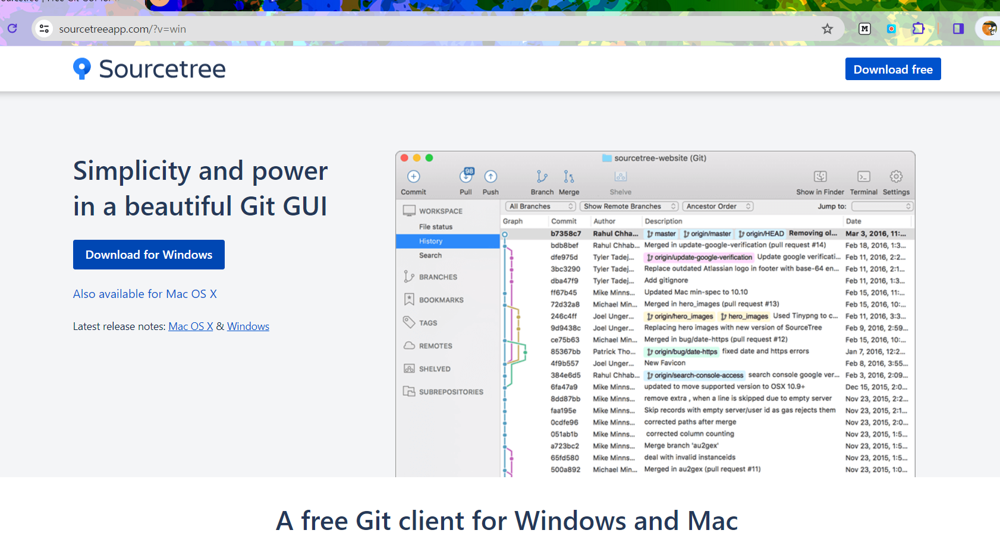
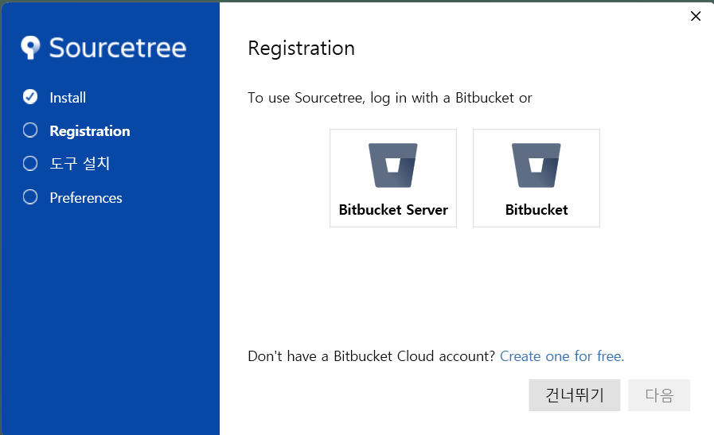
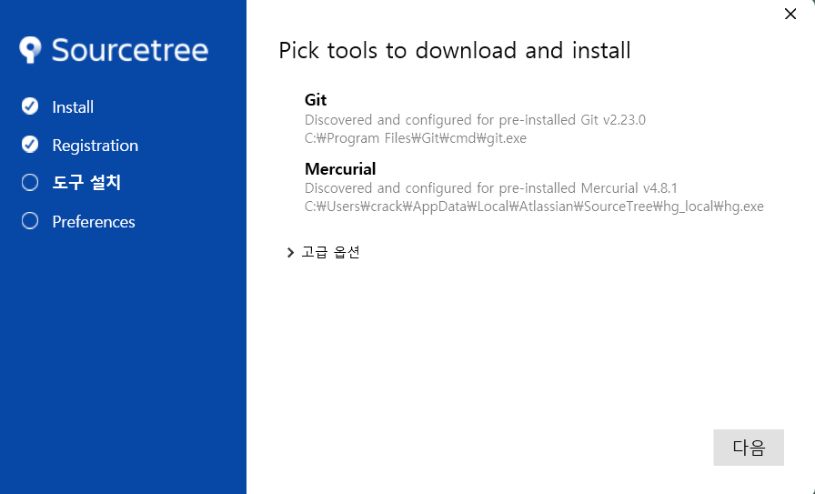
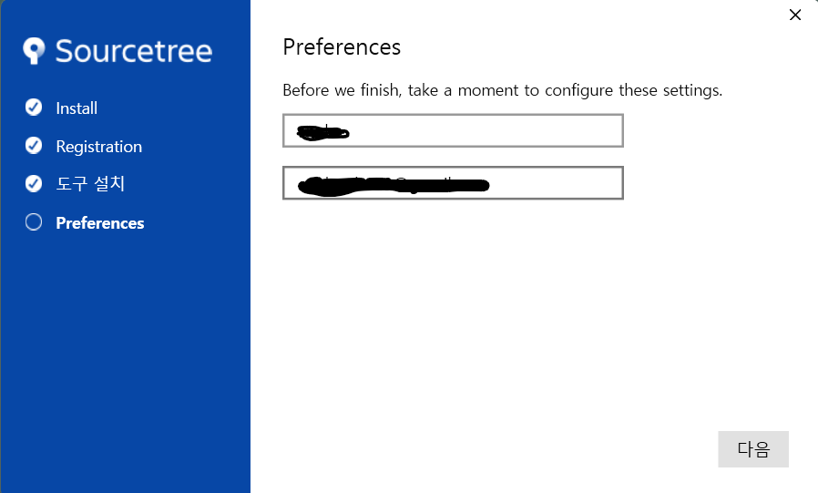
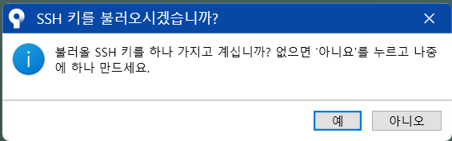

#  # 설치순서
다운로드 후 다음과 같은 과정을 거친다.

## 1. download

[sourcetree 설치](https://www.sourcetreeapp.com/)
## 2.

다운로드 후, 실행한다. install 단계에서 [건너뛰기]를 선택한다. 
## 3.

[다음]을 선택한다. 
## 4.

git에서 사용할 자신의 이름과 email을 지정한다.원하는 대로 아무 것이나 입력해도 된다.
## 5.

SSH를 [아니오]로 선택한다. 

