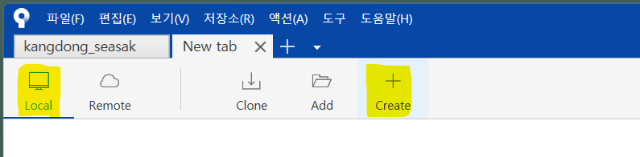
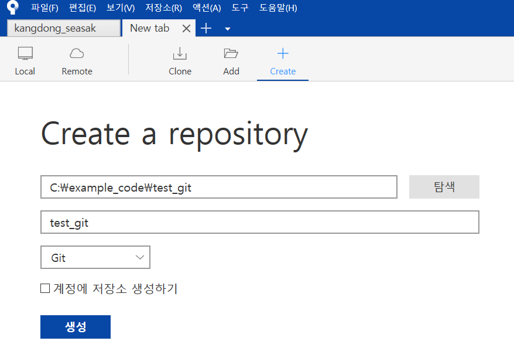
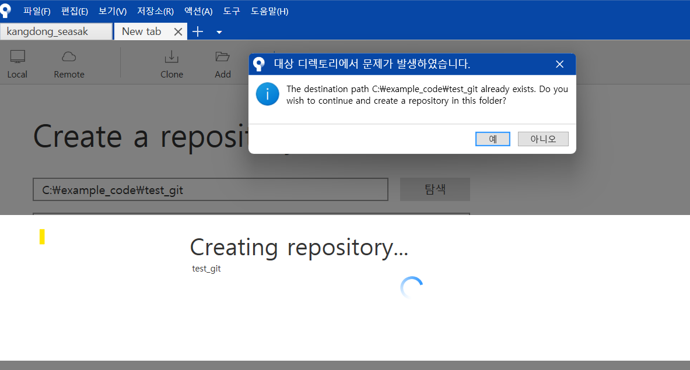
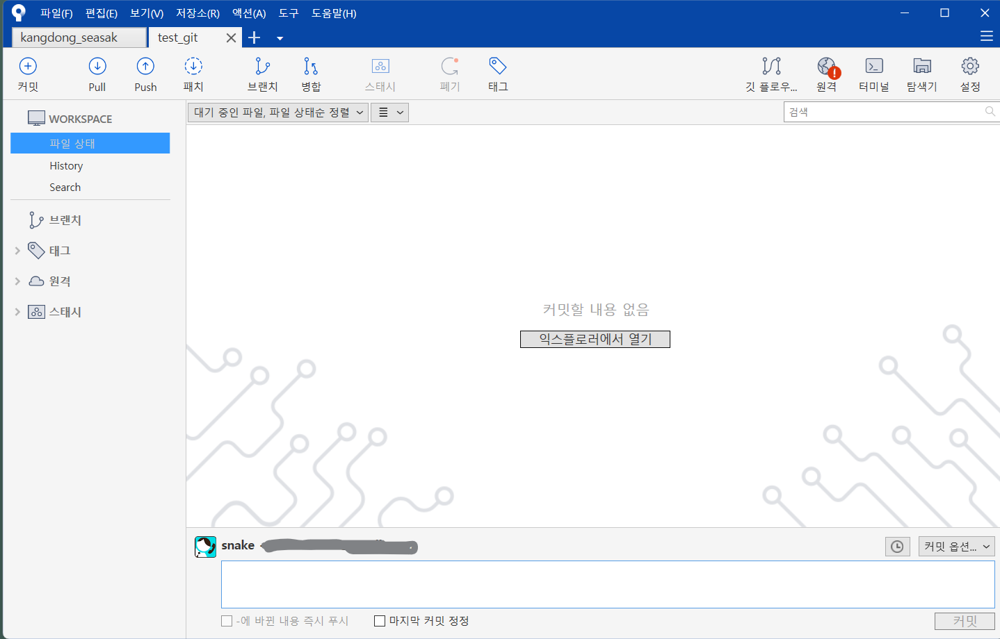

# local에 git 폴더 만들기
다운로드 후 다음과 같은 과정을 거친다.

## 1. Create 버튼으로 생성

상단 tool 바에서 좌측에서 Local을 선택하고 우측에서 Create(+)를 누른다.
## 2. Create a repository 정보

[New tab]이 생성된다. 이곳에서 [탐색]을 눌러 PC의 특정 디렉토리를 선택한다. 그리고 위의 화면과 같이 Git을 선택한다.  
## 3. 생성 및 확인 메시지

repository가 생성된다. 만약, 기존에 폴더가 있다면 계속 만들 것인지 물어본다.[예]를 누르면 된다. 
## 4. Local repository 생성완료 화면

git을 사용할 수 있는 폴더가 생성되었다. 이 폴더에서 파일을 추가, 삭제, 수정을 할 수 있다. 파일을 조작할 때, sourcetree가 필요한 것이 아니다. git을 통해 [이력관리] 할 때만 sourcetree를 사용한다.

