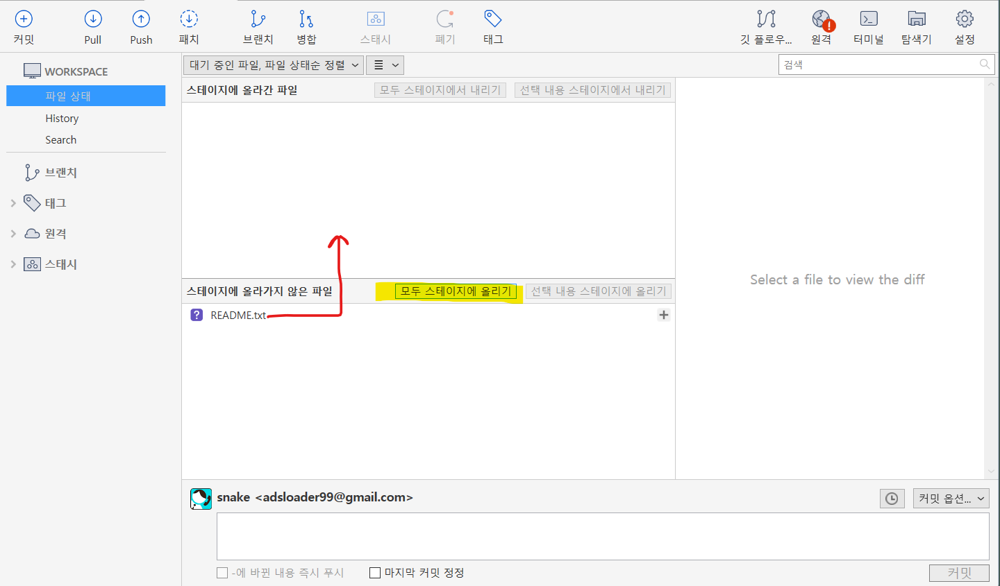
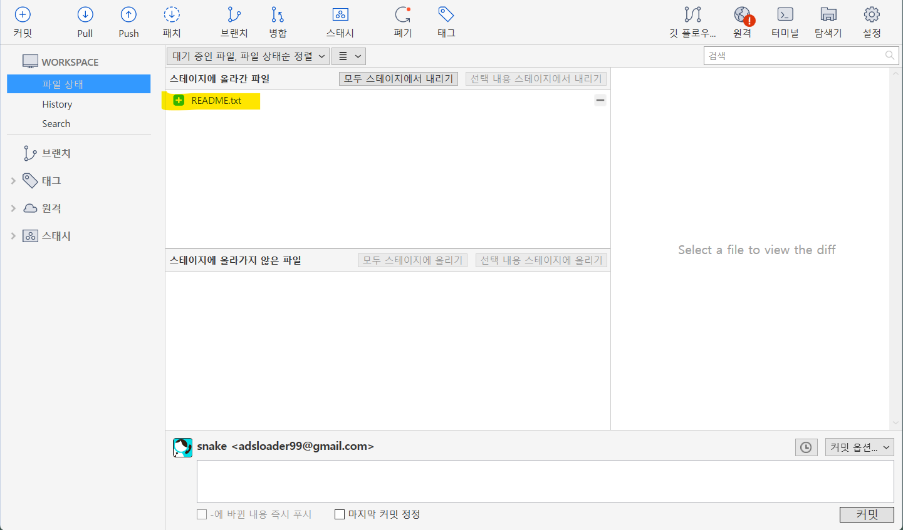
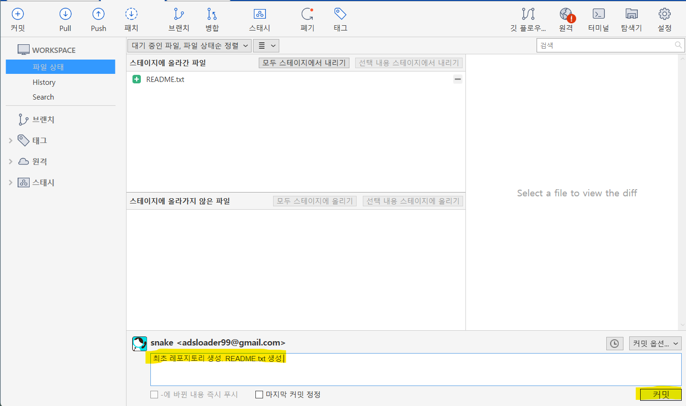
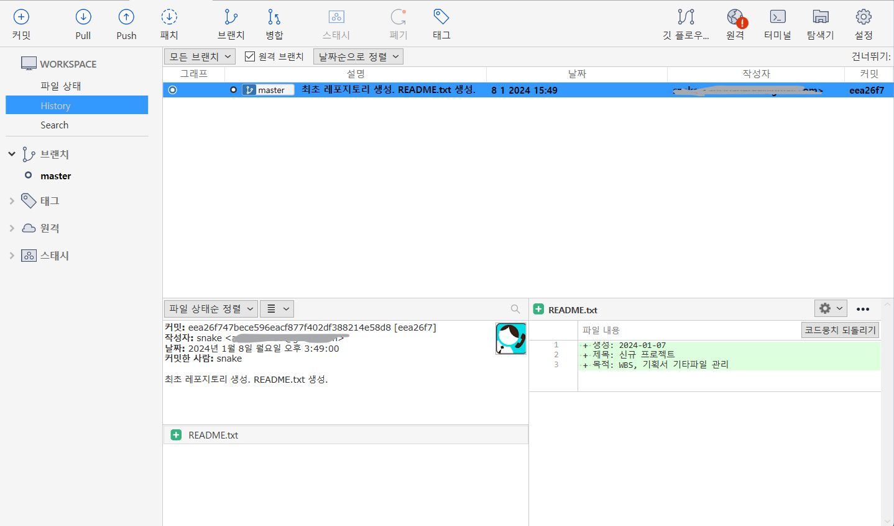

# local에 git 폴더 파일 생성 및 최초 commit 하기 
git 워크스페이스(=폴더)에서 파일을 다음과 같이 생성한다.

- README.txt라는 파일을 만든다. 
- 다음과 같은 내용을 저장한다.
~~~
생성: 2024-01-07
제목: 신규 프로젝트 
목적: WBS, 기획서 기타파일 관리
~~~

## 1. 파일변경 사항, Stage에 올리기

readme.txt를 생성했다.그러므로 Workspace 내의 변경된 파일이 파일검색 화면의 하단에 보인다. 이곳에서 변경된 파일을 [모두 스테이지에 올리기]를 선택하여 상태를 스태이지 상태로 변경한다. 

## 2. Stage 상태로 변경확인(add)

스테이지에 올리기를 선택하면 선택된 파일들이 [스테이지에 올라간 파일] 영역에 표시된다.이곳에서 파일을 선택하고 다시 스테이지에서 제외를 시킬 수도 있다.
## 3. repository에 올리기(commit)

스테이지에 올라간 파일을 commit 으로  repository에 올린다.이 때 메시지를 통해 변경된 내용을 짧게 서술한다. 한 번 지정한 commit 메시지는 수정하지 못한다고 생각하면 관리에 편하다. 수정할 수도 있지만 여러가지 면에서 부작용이 있다.
## 4. commit 히스토리 보기

좌측 history를 누르면 commit에 대한 이력화면을 볼 수 있다. repository에 올라간 history 정보는 commit을 할 때마다 추가된다. 그리고 history를 통해 당시의 상태로 돌아갈 수 있다. `timemachine과 같은 기능`이다. 

