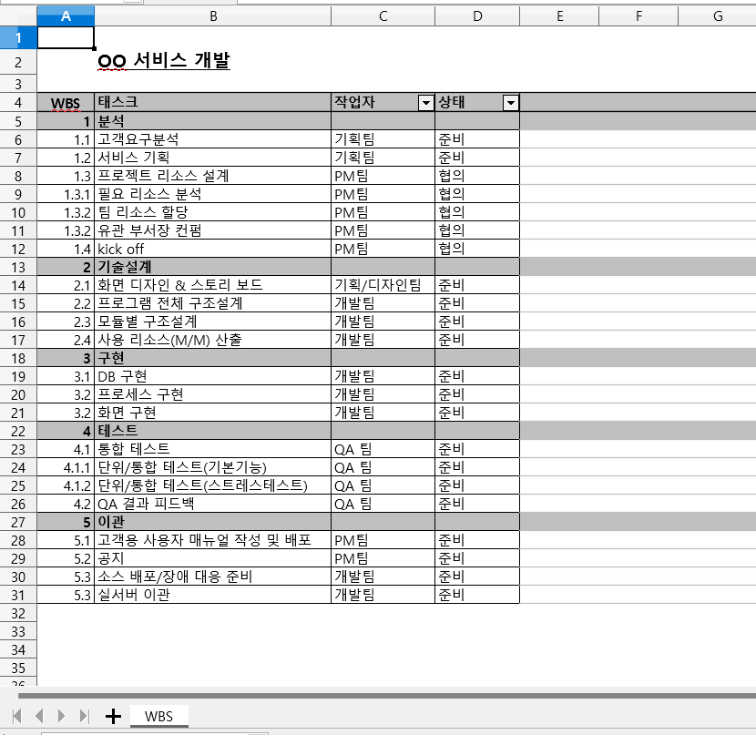
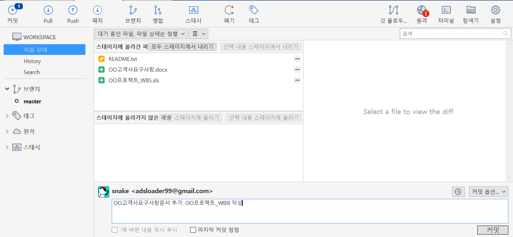
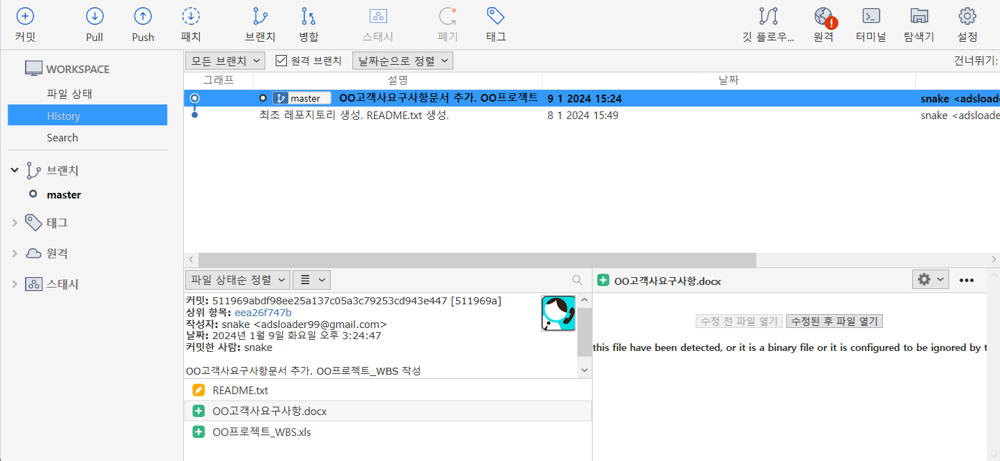

# 파일 추가해서 commit 하기 

업무를 하며 "OO고객사요구사항문와 OO프로젝트_WBS 작성"을 했다. 결과적으로 2개의 파일이 아래와 같이 생성되었다.

- 워킹 디렉토리에서 [변경된 파일](data/commit_2.zip)

~~~
1. 위의 변경된 파일을 추가한다.
2. 변경된 파일(스테이지에 올라기지 않은 파일)을 스테이지에 올라간 파일로 변경한다.
3. "OO고객사요구사항문서 추가. OO프로젝트_WBS 작성"와 함께 commit 한다. 
~~~

## 1. 파일변경 사항, Stage에 올리기

readme.txt가 변경되고 2개의 파일이 추가되었다.그러므로 Workspace 내의 변경된 파일이 파일검색 화면의 하단에 보인다. 이곳에서 변경된 파일을 [모두 스테이지에 올리기]를 선택하여 상태를 스태이지 상태로 변경한다. 

## 2. repository에 올리기(commit)

스테이지에 올라간 파일을 commit 으로 repository에 올린다. 히스토리가 추가된다.

