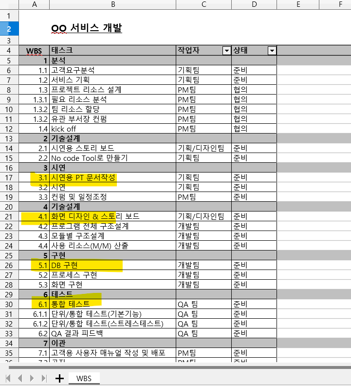
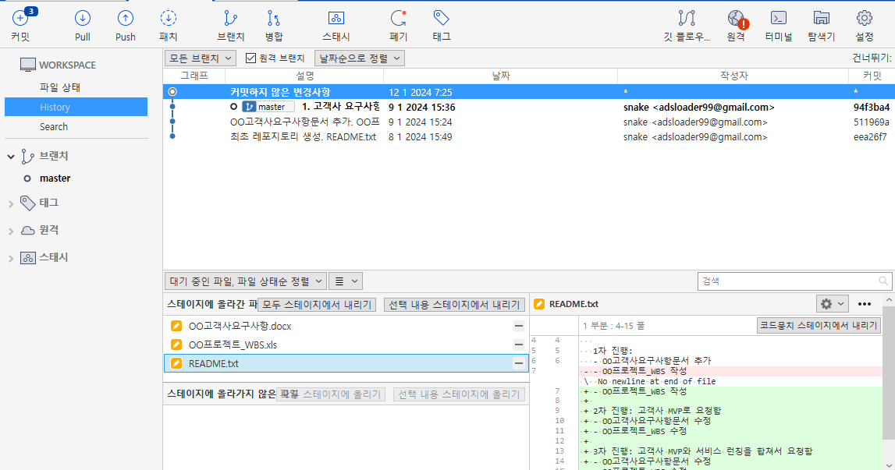
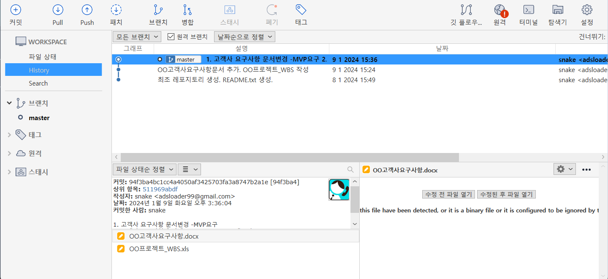

# 파일 변경해서 commit 하기 2 

업무요청으로 "OO고객사요구사항문와 OO프로젝트_WBS 작성"의 내용을 변경했다. 결과적으로 2개의 파일이 아래와 같이 변경되었다.

- 워킹 디렉토리에서 [변경된 파일](data/commit_4.zip)

~~~
1. 위의 변경된 파일을 추가한다.
2. 변경된 파일(스테이지에 올라기지 않은 파일)을 스테이지에 올라간 파일로 변경한다.
3. "고객사 요청 변경됨: MVP, 서비스 런칭 모두를 요구함" 메시지로 commit 한다. 
~~~

## 1. 파일변경 사항, Stage에 올리기

3개의 파일이 변경 되었다.그러므로 Workspace 내의 변경된 파일이 파일검색 화면의 하단에 보인다. 이곳에서 변경된 파일을 [모두 스테이지에 올리기]를 선택하여 상태를 스테이지 상태로 변경한다. 

## 2. repository에 올리기(commit)

스테이지에 올라간 파일을 commit 으로 repository에 올린다. 히스토리가 추가된다.

