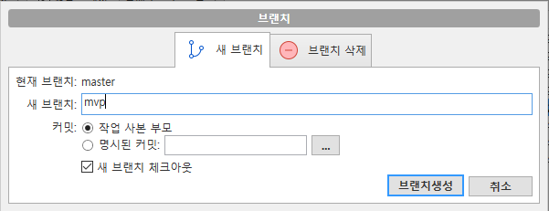
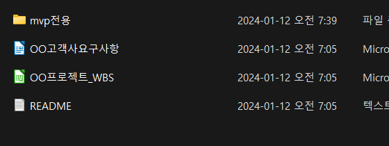
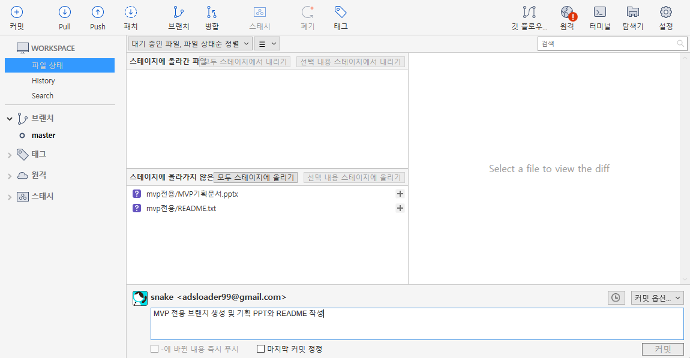
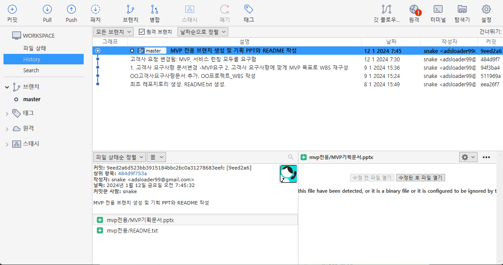

# 브랜치 만들고 commit 하기 1 

~~~

git에서 브랜치를 만드는 이유는 다양하다. 
여기에서는 작업 파일을 따로 분류하는 목적으로 사용했다. 

~~~

브랜치를 mvp로 만들고 파일을 작성한다. mvp를 집중하며 만들고자 하부 폴더를 만들고 그 안에 새롭게 파일을 생성했다.

- 워킹 디렉토리에서 [변경된 파일](data/commit_5_1.zip)

~~~
1. branch를 mvp로 만든다.
2. 위의 생성된 폴더와 파일을 오버라이트 한다.
3. 변경된 파일(스테이지에 올라기지 않은 파일)을 스테이지에 올라간 파일로 변경한다.
4. "고객사 요청 변경됨: MVP, 서비스 런칭 모두를 요구함" 메시지로 commit 한다. 
~~~

## 0. branch를 만든다. 

SourceTree 상단메뉴의  브랜치를 클릭하고 다음과 같이 브랜치를 만든다.

## 1. 파일변경 사항, Stage에 올리기

Workspace 내의 변경된 파일이 파일검색 화면의 하단에 보인다. 이곳에서 변경된 파일을 [모두 스테이지에 올리기]를 선택하여 상태를 스테이지 상태로 변경한다. 

## 2. repository에 올리기(commit)

스테이지에 올라간 파일을 commit 으로 repository에 올린다. 히스토리가 추가된다.

