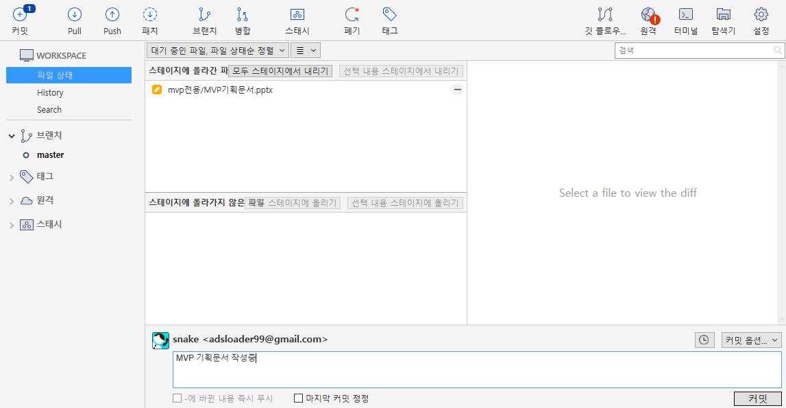
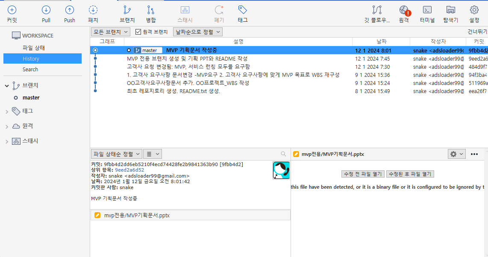

# 브랜치 만들고 commit 하기 2 

파일을 변경하고 commit 한다.

- 워킹 디렉토리에서 [변경된 파일](data/commit_5_2.zip)

~~~
1. 위의 생성된 폴더와 파일을 오버라이트 한다.
2. 변경된 파일(스테이지에 올라기지 않은 파일)을 스테이지에 올라간 파일로 변경한다.
3. "MVP 기획문서 작성중" 메시지로 commit 한다. 
~~~

## 1. 파일변경 사항, Stage에 올리기

Workspace 내의 변경된 파일이 파일검색 화면의 하단에 보인다. 이곳에서 변경된 파일을 [모두 스테이지에 올리기]를 선택하여 상태를 스테이지 상태로 변경한다. 

## 2. repository에 올리기(commit)

스테이지에 올라간 파일을 commit 으로 repository에 올린다. 히스토리가 추가된다.

