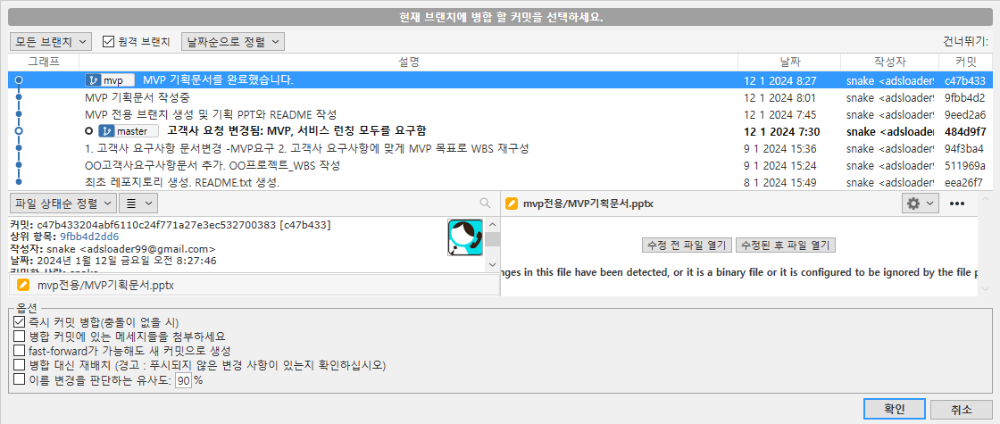

# 브랜치 합치기  

자신이 목적한대로 브랜치 작업을 완료했다면 master 브랜치와 merge(합치기) 한다.

- 워킹 디렉토리에서 [변경된 파일](data/commit_5_2.zip)

~~~
1. 위의 생성된 폴더와 파일을 오버라이트 한다.
2. 변경된 파일(스테이지에 올라기지 않은 파일)을 스테이지에 올라간 파일로 변경한다.
3. "MVP 기획문서 완료" 메시지로 commit 한다. 
4. 상단 메뉴의 병합을 눌러 합친다. 
~~~

# 1.  merge 하기 
master 브랜치의 최총 커밋으로 이동한다.  

이 때 모든 작업 파일들이 스테이지에 올라가 있어야 한다. 그리고 브랜치는 합치고자 하는 브랜치와 다른 위치에 있어야 한다.

