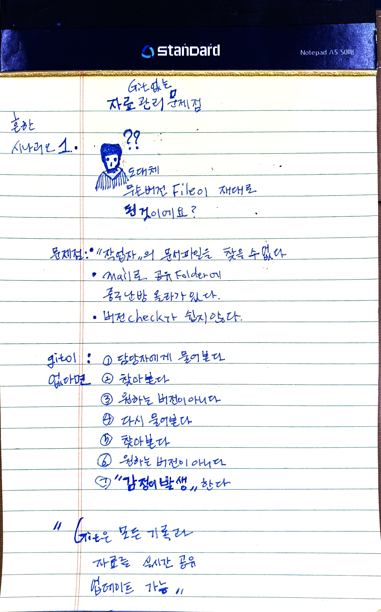
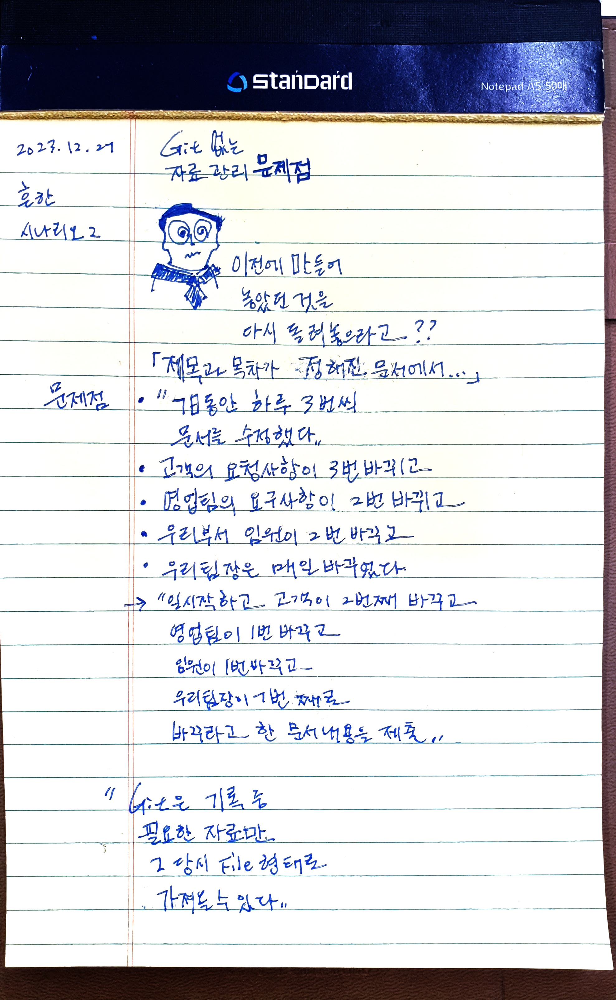
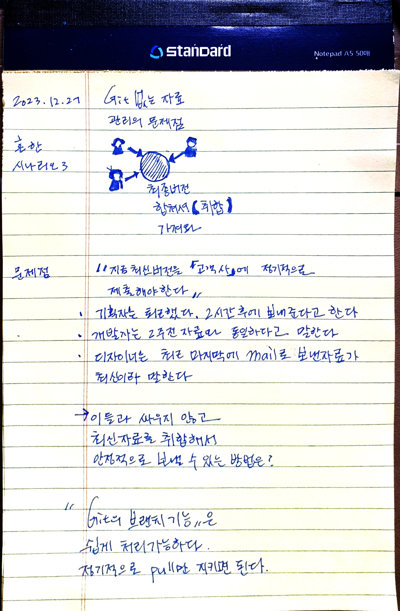

# PM에게 필요한 GIT

~~~
PM에게 git이 반드시 필요한 이유는 크게 2가지이다. 
1. 각종 문서의 이력관리 
2. 개발팀이 만든 결과물이 git으로 관리
~~~

`Git은 Timemachine` 이다.

~~~javascript
                 _-====-__-======-__-========-_____-============-__
               _(                                                 _)
            OO(  time machine: 파일을 "그 때"로 만들어줘!               )_
           0  (_                                                   _)
         o0     (_                                                _)
        o         '=-___-===-_____-========-___________-===-dwb-='
      .o                                _________
     . ______          ______________  |         |      _____
   _()_||__|| ________ |            |  |_________|   __||___||__
  (BNSF 1995| |      | |            | __Y______00_| |_         _|
 /-OO----OO""="OO--OO"="OO--------OO"="OO-------OO"="OO-------OO"=P
#####################################################################
~~~
## 1. git을 사용하는 않는 경우 - 현업 문제점 

### 1.1. 시나리오 - 1

> git으로 관리하지 않는다면 "담당자"에게 메일이나 전화, 오프라인으로 계속 물어보며 원하는 자료를 받을 때까지 꾸준히 대화를 해야 한다. 이것은 프로젝트 진행 시에 "스트레스" 또는 '불만'사항으로 발생한다. 

### 1.2 시나리오 - 2

> git으로 관리하지 않는다면 "버전"관리가 힘들어진다. 단순히 날짜_시간.zip 형태로 공유폴더에 올려놓는 다면 실시간 저장해야 할 시점에서 관리할 수 없는 상황이 발생한다. 그리고 이력관리가 힘들어진다(git은 commit시 메시지로 검색가능하다). 

### 1.3 시나리오 - 3

> 다수의 팀원들이 자신의 최신 자료를 동시에 취합하려고 한다면 git으로 관리해야 안전하다. 
> 메일이나 공유폴더 같은 방법을 사용할 경우, 최신버전을 취합하다가 시간이 간다. 그러나 git으로 각자의 자료를 branch하고 취합시 merge하는 방법을 사용한다면 실시간 취합을 빠르게 할 수 있다. 

### Ask 생성AI

🤖프롬프트 : "기획문서를 git으로 관리했을 때의 장점"
~~~
[TODO] 생성AI 결과는?
~~~

ChatGPT:
- 기획문서를 Git으로 관리하는 것은 다음과 같은 장점이 있습니다: 
1. **버전 관리** : 기획 문서의 변경 이력을 추적하고 관리할 수 있습니다. 각 수정 내역마다 변경점을 확인하고, 필요 시 과거 버전으로 손쉽게 돌아갈 수 있어요. 이는 기획 문서의 발전 과정을 명확하게 파악하고, 필요한 경우 이전 버전으로 복원할 수 있게 해줍니다. 
2. **협업 및 공유** : 여러 사용자가 동시에 기획 문서를 수정하고, 그 변경 사항을 쉽게 공유하며, 협업할 수 있습니다. Git을 통해 문서를 관리하면 여러 사람이 동시에 작업하더라도 각자의 변경사항을 합치고 관리할 수 있어요. 
3. **브랜치 관리** : 새로운 아이디어나 수정사항을 실험하고 싶을 때, 브랜치를 생성하여 작업할 수 있습니다. 이는 기획문서를 안전하게 수정하고, 안정적인 메인 문서와 실험적인 아이디어를 분리하여 관리할 수 있게 해줍니다. 
4. **충돌 해결** : 다수의 사람들이 같은 기획 문서를 수정할 때 생길 수 있는 충돌을 감지하고, Git을 통해 충돌을 해결할 수 있습니다. 이를 통해 협업 과정에서 발생할 수 있는 오류와 문제를 최소화할 수 있습니다.

Git은 코드뿐만 아니라 문서와 같은 비코드 자료도 효과적으로 관리할 수 있는 강력한 도구입니다. 이를 통해 기획 문서의 작업과 협업을 보다 체계적으로 이끌어낼 수 있습니다.

## 2. 예제와 매뉴얼
> sourcetree를 이용한 git 사용예제를 학습한다. 

#TODO 

 1. [git 설치](https://git-scm.com/download/)
    - 설치 시 "특별한 설정없이" next 
    - `git config --global user.name "사용자이름"` 
    - `git config --list`
 2. [sourcetree 설치](https://www.sourcetreeapp.com/)
    - [설치방법](2.1_sourcetree설치.md) 
 3. 따라하기 매뉴얼
    - 기본기: [초간단 git](2.0_초간단GIT.md) 
    - step 1 : [local에 git 폴더 만들기 ](2.2_localgit_생성하기.md)
    - step 2 : [최초로 repo에 commit하기 ](2.3_localgit_최초_커밋하기.md)
    - step 3 : [ 파일 추가한 후 commit하기 ](2.4_파일추가해서_커밋하기.md)
    - step 4 : [ 파일 변경 후 commit하기 1](2.5_파일내용_변경해서_커밋하기%201.md)
    - step 5 : [ 파일 변경 후 commit하기 2](2.6_파일내용_변경해서_커밋하기%202.md)
    - step 6 : [ 브랜치 만들기 1](2.7_브랜치만들기_mvp_1.md)
    - step 7 : [ 브랜치 만들기 2](2.8_브랜치만들기_mvp_2.md)
    - step 8 : [ 브랜치 합치기 3](2.9_브랜치합치기_mvp_3.md)
    - 참고사항: [sourcetree 사용](2.10_sourcetree_참고사항.md) 
 4. [예제 - 1 repository](data/git_test.zip)