# GITHUB이란

~~~
git을 이용한 세계최대의 지식저장소 
1. 개발자들의 오픈소스 및 이력관리 
2. 개발팀들의 프로젝트 협업 장소
3. Microsoft가 인수하여 관리 
4. IT 전문가들의 브랜딩으로 활용
~~~

github은 전세계 대부분의 `지식생산자`들에게 사용되는 지식공유 저장소이다. 기업, 개인, 단체, 학교 모든 곳에서 다양한 규모로 사용하고 있다. 

| 이름 | 주소 |
| ---- | ---- |
| Google | [Google](https://github.com/google) |
| Microsoft | [microsoft](https://github.com/microsoft) |
| 삼성 | [삼성](https://github.com/samsung) |
| Open Ai | [Open AI](https://github.com/OpenAI) |
| Harvard | [Harvard](https://github.com/Harvard) |

## 1. 따라하기 
> github에 계정을 만들고 profile을 작성한다. 
> repository를 만들고 자신의 PC에서 SourceTree로 연동한다.  

 1. [👩🏾‍💻 github 가입](https://github.com/)
    - <iframe width="560" height="315" src="https://www.youtube.com/embed/lelVripbt2M?si=LRE55yHsZDPj7ef6" title="YouTube video player" frameborder="0" allow="accelerometer; autoplay; clipboard-write; encrypted-media; gyroscope; picture-in-picture; web-share" allowfullscreen></iframe>
    - `무료회원 선택` 
    - `비밀번호, 계정관리 엄수` <- 가끔 중요한 것을 놓치는 경우가 있음.
 2. [👩🏾‍💻 profile 고치기](https://github.com/)
    - github 홈페이지로 이동한다. 
    - 자신의 계정과 비번으로 로그인 한다.
    - 우측 상단의 계정 아이콘을 클릭한다. 
    - [your profile](#)을 선택한다.
    - 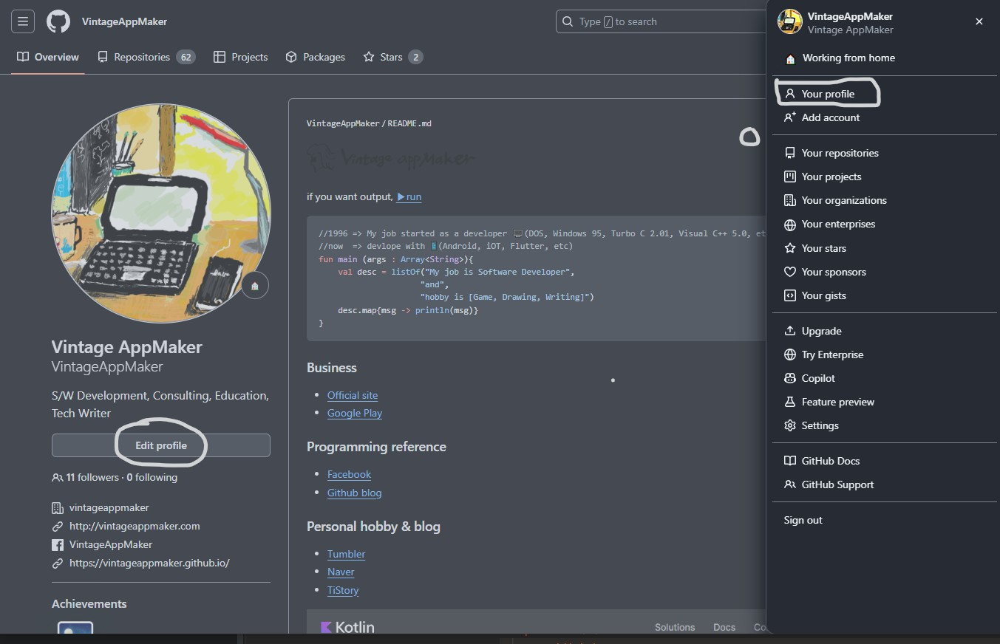
    - 자신의 프로필을 지정할 수 있는  [자신의계정명/README.md](#) 파일이 보인다. 
    - 이곳에서 우측 상단의 [필기구 아이콘](#)을 클릭한다.
    - 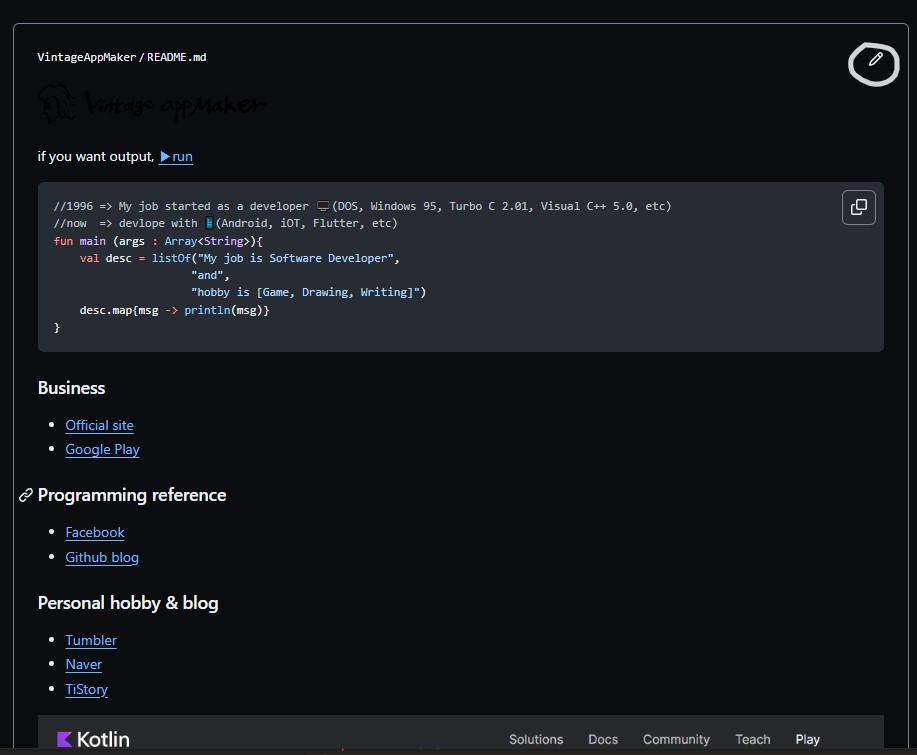
    - Markdown 파일을 수정할 수 있다. 이곳에서 자신이 원하는 프로필을 만들고 저장한다. 
    - 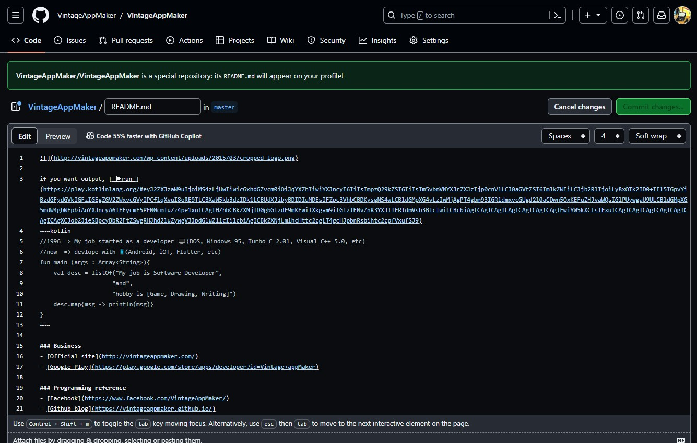
    - 📢 주의: github 프로필은 `이력` 을 적는 것이 아니라 `역량`을 기입하는 것이 좋다. 내가 무엇을 했다는 프로젝트 외에는 의미가 없고, 내가 뭐를 할 수 있다를 프로필로 적어주는 것이 common sense이다. 
 3. `👩🏾‍💻 repository 만들기` 
    - 상단 메뉴에서 repositories 탭을 선택한다. 
    - 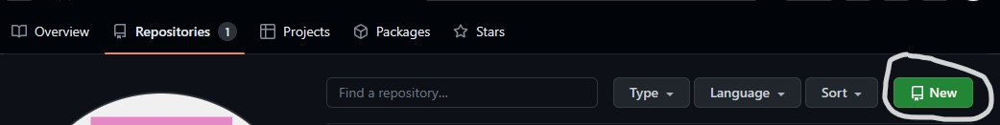
    - 이곳에서 우측에 있는 New 버튼을 선택한다.
    - 그러면 다음과 같은 [New repository](#) 화면이 나타난다.
    - 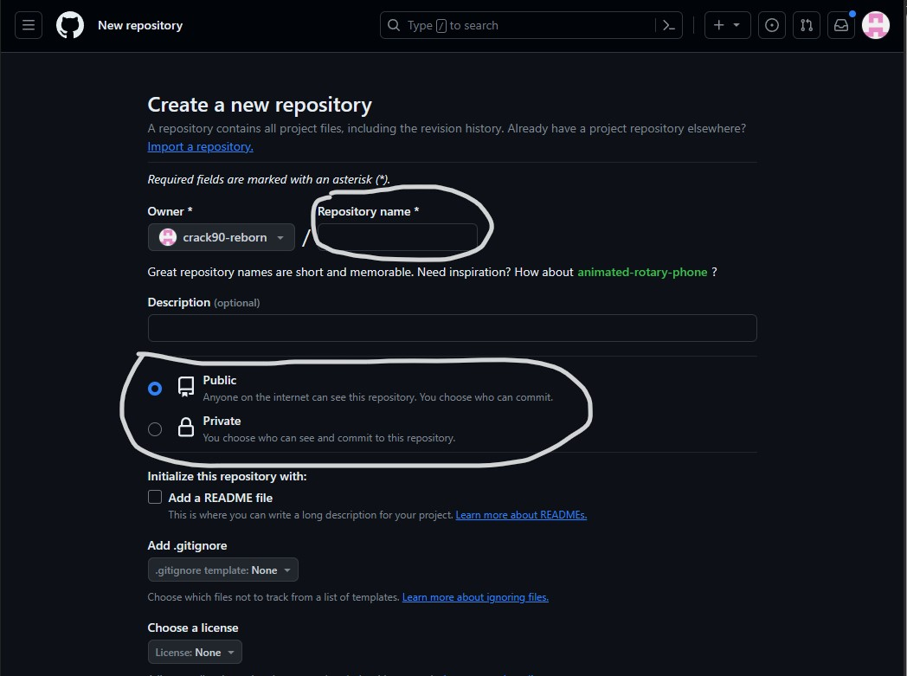
    - 이곳에서 Repository name에 이름을  작성한다.
    - 그리고 Public 또는 Private로 Repository의 특성을 설정한다. 
	    - public은 외부에서 볼 수 있음
	    - private은 내부에서만 볼 수 있음
    -  작성이 완료되었으면 하단의 [Create repository](#) 버튼을 클릭한다.
    - 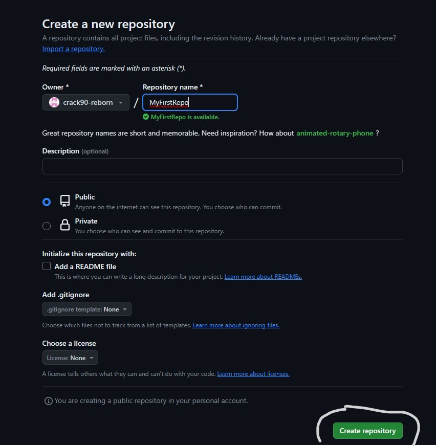
    - repo가 완성되었다는 화면이 다음과 같이 나타난다. 
    - 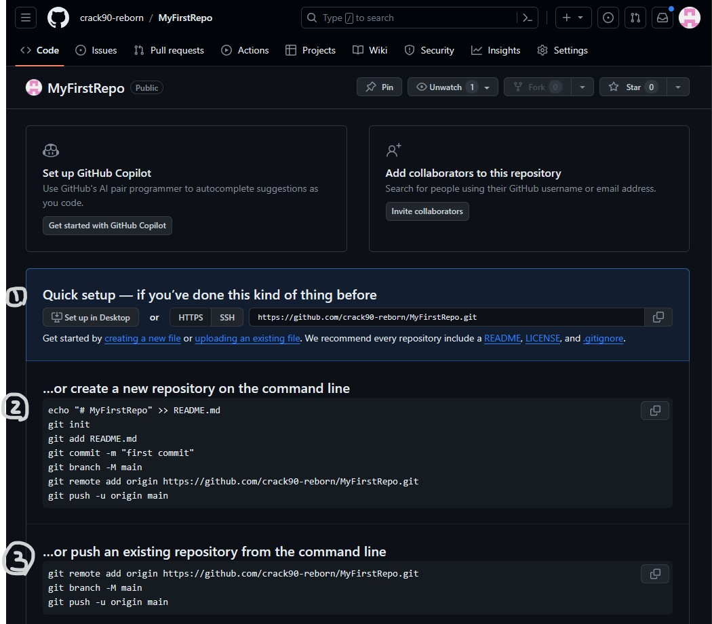
    - 그리고 3가지 방법으로 원격연결을 할 수 있는 방법을 제공한다. 
	    - 1번의 경우,  github desktop이 설치되어 연동되는 방법이다. 
	    - 2번의 경우, PC의 콘솔화면에서 git으로 repository를 생성하고 연결하는 방법이다. 
	    - 3번의 경우, 2번과 동일하나 기존의 git으로 관리되는 repository에 원격으로 연결하는 방법이다. 
	- 단순히 repository를 PC로 가져올 목적이라면 1번에서 제공하는 주소로 HTTPS를 이용해 가져올 수 있다. 
		- `git clone [repository주소]`
		- 
 4. `👩🏾‍💻 생성한 local git에서 github에 push`하기
    - repository를 위와 같이 만들면 가져올 수는 있으나 업로드는 할 수 없다. 
    - 이유는 계정과 연동하지 않았기 때문이다. 
    - 테스트를 위해 다음과 같이 위에서 만들어 놓았던 git 폴더에서 작업을 수행한다.
	    - 1. 위에서 생성한 git 폴더로 이동한다.
	    - 2. 임의의 파일을 만든다(`echo "아무말이나" >> README.md`).
	    - 3. `git add .` 현재 작업 디렉토리의 모든 파일을 statge로 등록한다.
	    - 4. `git commit -a -m "메시지"` commit을 하면서 repository에 등록한다. 
	    - 5. `git push`를 실행하면서 원격지에 commit한 내용을 등록하고자 한다. 
	    - 6. `에러가 발생했다.` 계정에 대한 비밀번호 권한이 설정되지 않았기 때문이다. 
    - 
 5. `👩🏾‍💻 github 계정과 비번 연동`하기
    - 1. github으로 이동 -> 우측상단 프로필 선택 -> [Settings]
    - 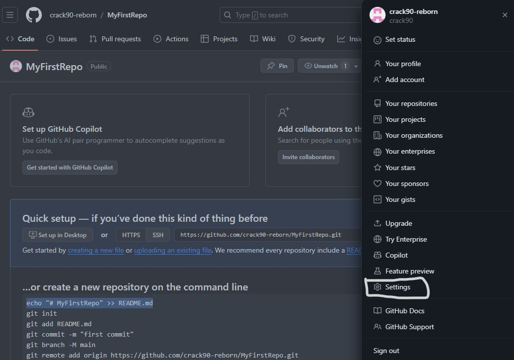
    - 2. 좌측 Settings에서 최하단 [Developer Settings] 선택 
    - 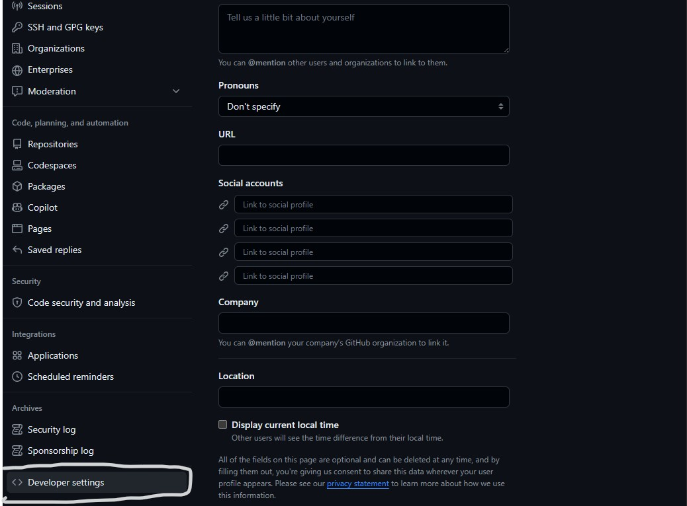
    - 3. [Personal access tokens] 에서 [Token (classic)]선택 
    - 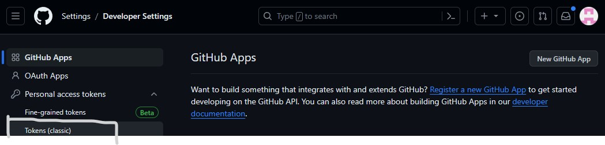
    - 4. Generate a personal acess token 선택
    - 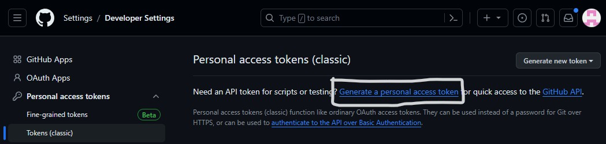
    - 5. 이곳에서 [Note]에 토큰 이름을 지정한다. 그리고 유효기간(Expiration)을 선택하고 repo를 채크한다. 
    - 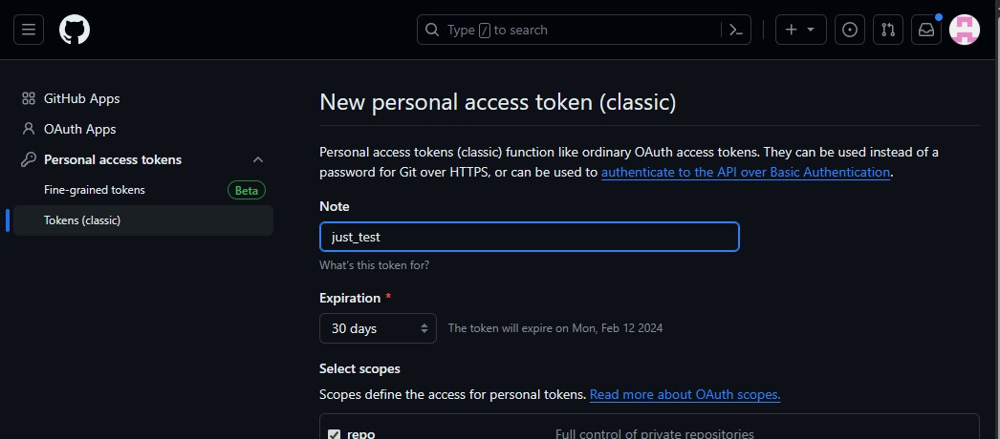
    - 6. 액세스 토큰이 생성된다. 반드시 이때 복사해야 하며 PC 어딘가에 복사하고 관리해야 한다. 나중에 복사 및 수정이 불가능하다. 토큰을 잃어버리면 삭제하고 추가 생성 해야 한다. 
    - 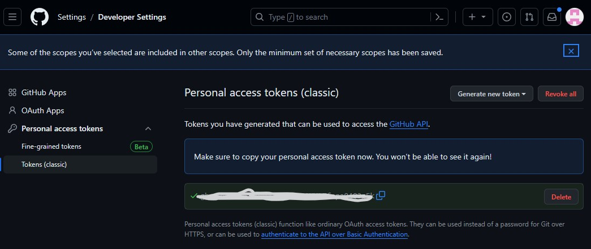
    - 7. sourcetree에 가서 다음과 같이 설정한다. 
	    - remote 탭으로 이동
	    - 원격저장소에 repository 주소를 입력
	    - [계정추가]를 click
	    - 호스트 서비스에 [github], 선택 프로토콜 [HTTPS], 인증은 [ Personal Access Token ], 사용자명은 [github 계정]을 입력한다. 
	    - Personal Access Token 새로고침을 누른다. 
	    - 계정명과 액세스 토큰을 입력하고 확인을 누른다. 
    - 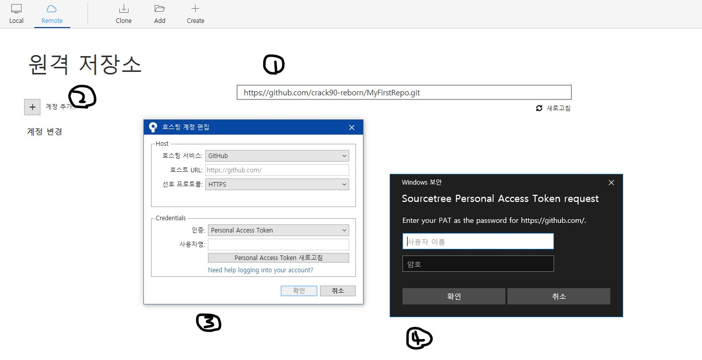
    - 8. local 저장소로 탭을 이동후, 이전에 만들었던 repository로 이동한다. 
    - 9. push 한다. 
    - 다음과 같이 repository가 upload된 결과가 보인다. 
    - 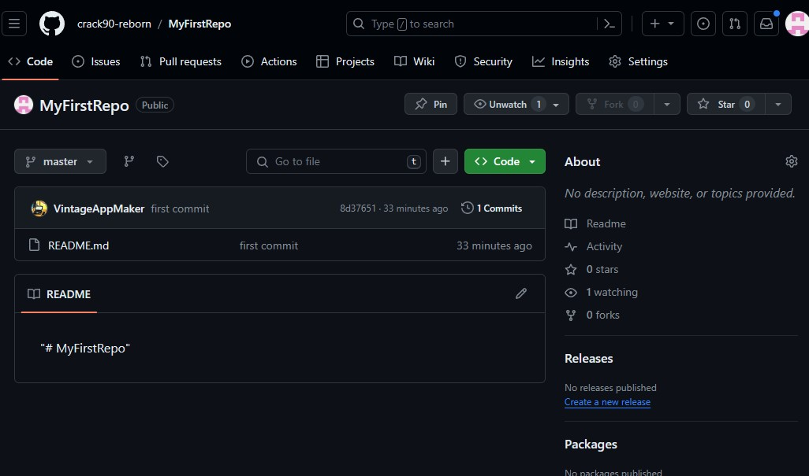
 4. `👩🏾‍💻 github blog 만들기`
    - repository는 무조건 public으로 설정해야 한다. 
    - `초간단 방법` - 초급
	    - 1. 자신의 계정에 repository를  [계정명.github.io](#)와 같은 이름으로 만든다. 
	    - 2. README.md에 "안녕하세요"를 입력하고 저장한다. 
	    - 3. 한 참 후에 [https://자신의 계정명.github.io](#)로 접속해본다.
    - `HTML을 직접 올리는 방법` - 중급
	    - 1. 자신의 계정에 repository를  [계정명.github.io](#)와 같은 이름으로 만든다. 
	    - 2. local로 git을 연동한다(위의 내용참조). 
	    - 3. HTML을 만든다(Obsidian의 HTML 플러그인 사용 권장).
	    - 4. commit 하고 push 한다. 
	    - 5. 한 참 후에 [https://자신의 계정명.github.io](#)로 접속해본다.
    - `jekyll을 이용하는 방법` - 고급
	    - 1. [http://jekyllthemes.org/](http://jekyllthemes.org/)에 가서 쇼핑한다.  
	    - 2. 원하는 테마를 고르고 [Homepage](#)를 클릭한다. 
	    - 3. 제작자의 github으로 이동된다.
	    - 4. 상단 메뉴에서 [Folk](#)를 선택한다. 그러면 나의 Repositories에 Folk된다. 
	    - 5. Folk된 Repository를 [계정명.github.io](#)로 한다. 
	    - 4. commit 하고 push 한다. 
	    - 5. 한 참 후에 [https://자신의 계정명.github.io](#)로 접속해본다.
	    - 6. [Jekyll](https://jekyllrb.com/tutorials/home/)과 markdown을 공부하며 github blog를 만들어본다. 
	    - 7. 예제: [Vintage appMaker github blog](https://vintageappmaker.github.io/)
