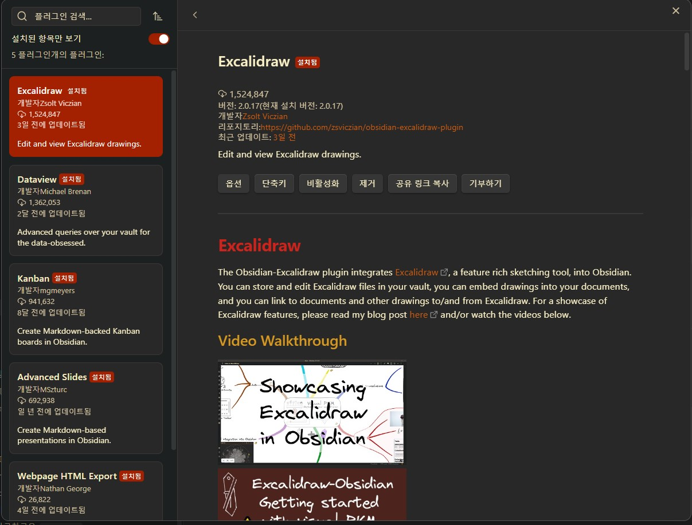

# Obsidian 이란
> markdown 기반의 문서 에디터.  [제텔카스텐](https://www.google.com/search?q=%EC%A0%9C%ED%85%94%EC%B9%B4%EC%8A%A4%ED%85%90)을 추구하는 메모관리자나 지식관련사업(출판, 논문, 엔지니어링, ..) 종사자에게 각광받는 에디터. 특히 PKM(Personal Knowledge Management)를 중요시 여기는 사람들에게 절대신공의 Tool로 여겨지고 있다. 


~~~
Obsidian은 다음과 같은 특징이 있다 
1. markdown 기반의 에디터
2. 개발도구와 맞먹는 오픈소스 플러그인(Notion의 기능보다 강력함)
3. 자체 내장한 Canvas 기능(시각적 마인드맵) 
4. Backlink, GraphView 기능
5. 심지어 무료(클라우드 기능만 사용하지 않는다면)
~~~

## 1. Quick Start 
> Opsidian을 설치하고 빠르게 사용해본다. 

 1. [설치](https://obsidian.md/download)
    - `자신의 운영체제에 맞게 다운로드` 
    - `더블클릭 후, 설치` 
 2. 실행 및 설정
    - 설정으로 이동: 
	    - 언어에서 한국어
	    - 테마 선택
 3.  플러그인 설치
	 1. 커뮤니티 플러그인을 활성화 하고 탐색하여 설치한다. 
	 2. [Excalidraw](https://vintageappmaker.tistory.com/539) : 강력한 오픈소스 화이트보드 
	 3. 
	 5. Webpage export HTML: 옵시디언 문서를 HTML로 퍼블리싱 
	 6. 
	 7. kanban: 칸반보드를 생성하여 GTD를 관리할 수 있다. 
	 8. 
	 9. Advanced Slides: 마크다운으로 바로 slide를 만들어 PT가능. 
	 10. 
 4. 10분 컷 Obsidian 학습  
    - 1. 폴더 만들기와 파일 만들기
	    - 
    - 2. 파일 복사 및 링크
	    - 
	    - pdf, html로 export 하기
		    - 
		    - 
	    - 
    - 3. canvas 만들기
	    - 


## 2. 생존을 위한 markdown 문법
> markdown은 표준이 존재하지만 각 Tool과 서비스에서 확장해서 사용하는 것이 일반적이다. 다음은 필수로 지원해야 하는 markdown 규칙에 대해서 설명하고 있다. 

### 1. **제목 (Headers):** 

"#"이 적을 수록 제목의 외형크기가 커진다.
```markdown
# 제목 1
## 제목 2
### 제목 3
```

---

### 2. **볼드 및 이탤릭 (Bold & Italic):** 

```markdown
**볼드 텍스트**
*이탤릭 텍스트*
```
결과:
**볼드 텍스트** 
*이탤릭 텍스트* 

---

### 3. **목록 (Lists):** 
첫 줄에 숫자를 입력 후, .와 함께 space를 누르면 숫자 순서대로 목록이 생성된다. 첫 줄에 -로 시작하고 space를 누르고 문자를 입력하는 순서없는 목록이 된다.
```markdown
- 항목 1
- 항목 2
  - 하위 항목
1. 순서 있는 항목 1
2. 순서 있는 항목 2
```
결과:
- 항목 1 
- 항목 2
  - 하위 항목
1. 순서 있는 항목 1
2. 순서 있는 항목 2 

---

### 4. **링크 (Links):** 
문서내의 링크를 지정한다. [] 안에는 메시지 () 안에는 링크정보를 입력한다.
```markdown
[링크 텍스트](http://www.example.com)
```
결과:
[링크 텍스트](http://www.example.com/) 

---

### 4. **이미지 (Images):** 
링크와 같지만 !로 시작한다. 그리고 url이나 경로명을 ()에 넣는다.
```


```
결과:


---
### 6. **코드 (Code):** 

소스코드를 표시한다. 첫줄에 사용하는 언어를 표시하면 해당언어에 맞게 syntaxhighighting도 지원한다.  
```markdown
인라인 코드: `코드 예제`
코드 블록:

~~~python
def hello_world():
    print("Hello, world!")
~~~

```


결과:
```python
def hello_world():
    print("Hello, world!")
```

---
### 7. **인용문 (Blockquotes):** 

```markdown
> 이것은 인용문입니다.
```
결과:
> 이것은 인용문입니다.

---
### 8. **구분선:** 
-를 3개 입력하면 구분선을 표시한다.
```

---

```
결과:

---

### 9. **표**:

```
| 제목 | 내용 |
| --- | --- |
| 고양이 | 성격은 특이하지만 보고 있으면 기분이 좋아지는 동물 |

```

| 제목 | 내용 |
| --- | --- |
| 고양이 | 성격은 특이하지만 보고 있으면 기분이 좋아지는 동물 |

---

그 외에도 mermaid 같은 확장 markdown 플러그인들이 존재한다. 

## 3. Obsidian으로 만들기
#TODO
1. Obsidian 프로젝트 생성 
2. 위의 플러그인 설치  
3. 위의 생존을 위한 markdown 문법 내용을 markdown 파일로 저장하기
