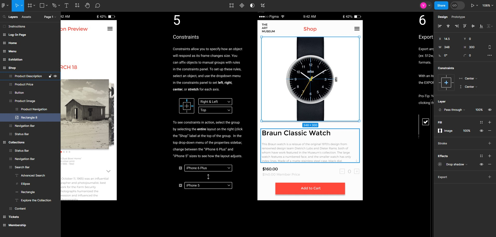

# 개발자와 디자이너 협업

## 1. 오프라인(고전적인 방법)
> 온라인 협업툴이 나오 전까지는 디자인 가이드는 ppt나 pdf로 만들어 보냈다. 그리고 그 문서에 언급된 이미지 자료들을 압축해서 보냈다. 

이에 따르는 문제점은 다음과 같다. 

- 소통의 시간이 너무 오래 걸림
- 디자이너가 만든 자료를 쉽게 받아보기 힘든
	- 자료의 크기
	- 갱신의 속도
	- 문서의 오류 및 관리
~~~mermaid
flowchart TD

A[디자인 협의] --> B[디자인 작업]
B --> C[디자인 커팅, 디자인 가이드 문서]
C --> D[파일압축 및 개발자에게 보내기]
D --> E[파일없다고 reject]
E --> C
~~~

## 2.  온라인 협업
> 온라인에서 협업하며 실시간 수정 및 추가. 2018년 이후부터 대부분의 개발 프로젝트에서는 온라인 협업툴을 사용하고 있음.

대표적인 소프트웨어는 다음과 같다. 

- [제플린](https://zeplin.io/)

- [피그마](https://www.figma.com/)

