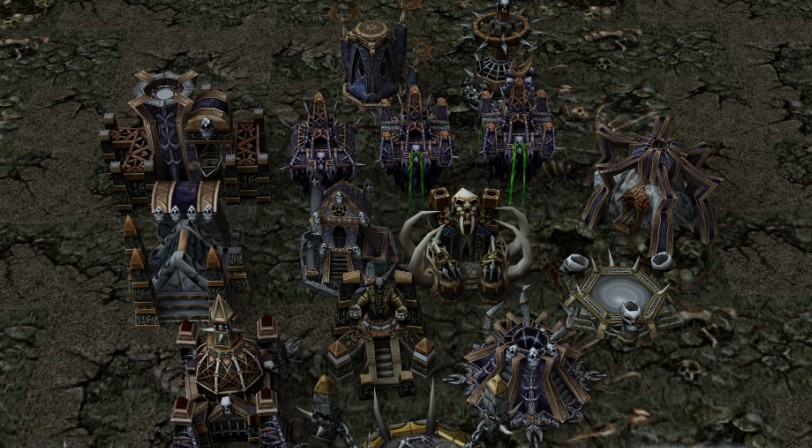
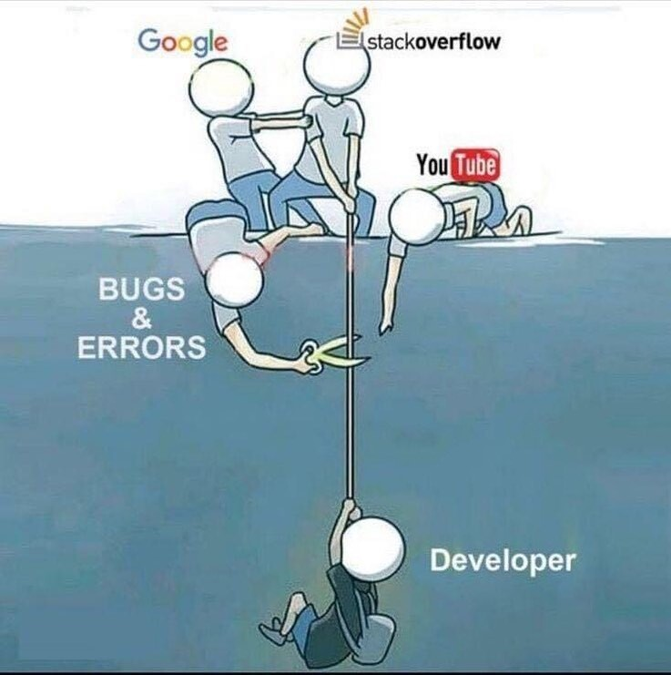
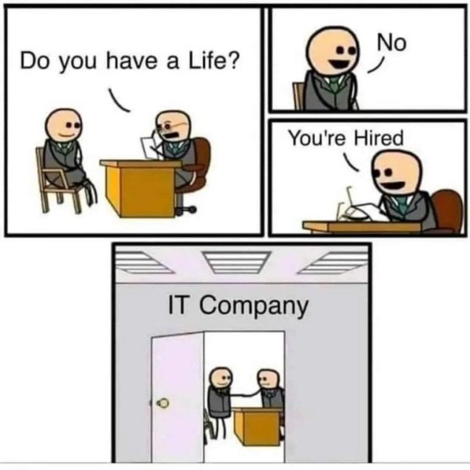
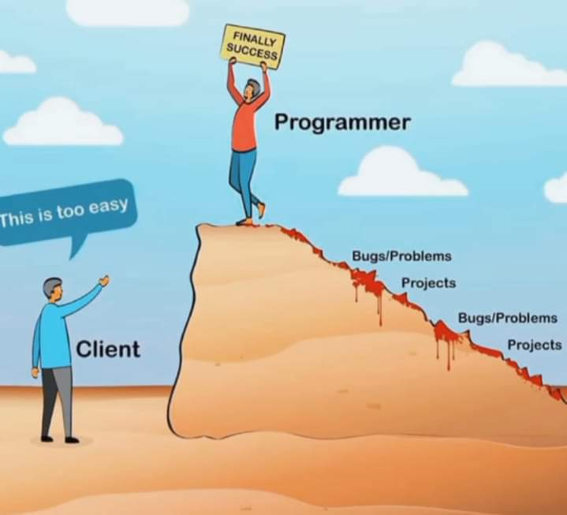
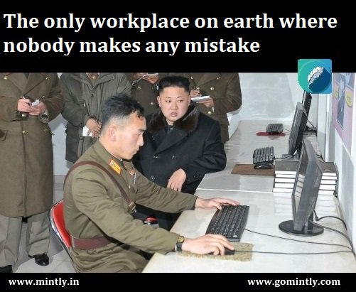
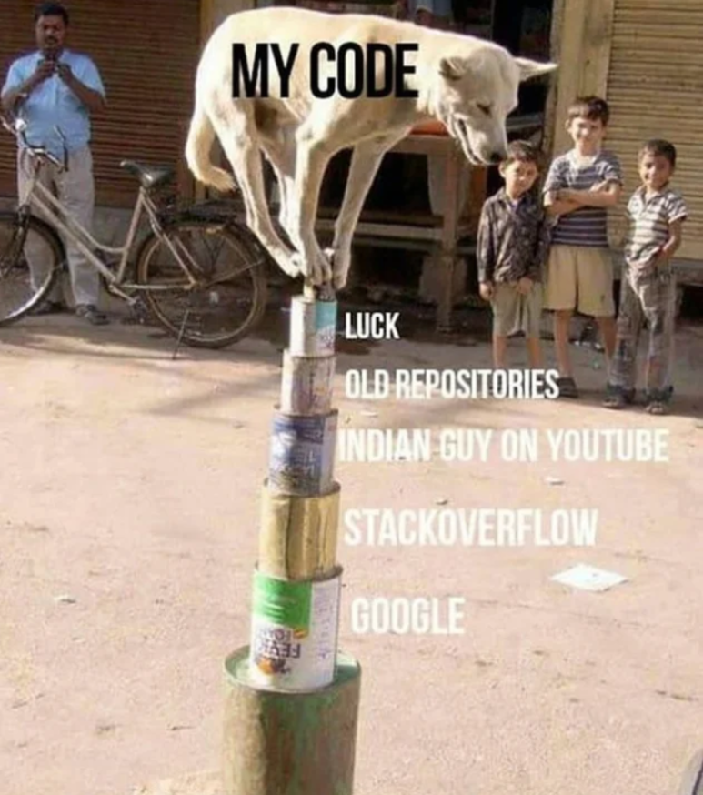

# 개발자와 대화법
> 개발자와 원할한 업무소통을 위한 How-To와 금칙어 정리
28년차 개발자 출신 PM이 생각하는 기획자, 디자이너, 개발자, QA의 Warcraft 3 종족별 매칭은 다음과 같다. 

**흔한 개발자 불만:**
개발자의 대표적인 협업에 대한 불만은 `기획자가 공부하지 않는다`, `디자이너가 경험이 없다` 이다. 기획자에게 물어볼 내용을 도리어 개발자에게 되묻는 경우가 허다하다(대표적: 앱마켓 정책같은 법률적인 것, 과금정책, 운영비용 같은 것조차 프로젝트 진행 중에 개발자에게 물어본다).  그리고 경험없는 디자이너의 경우, 시스템과 무관한 디자인을 하는 경우가 적지 않다(대표적: 앱화면 요청에 웹화면을 만드는 경우, iOS와 Android를 구분 못하는 경우).   

| 직군 | 종족 | 이유 |
| ---- | ---- | ---- |
| 기획자 | 휴먼 |  1. 세상을 꿈꾸는 자(현실과 싸움이 잦음).  2. 세상의 부족함을 채워주는 Healer.   3. 남을 설득하지 못하면 무능할 수도 있는 통솔자.  기획은 꿈이고 계획이고 설계이다. 기획 없는 서비스는 존재할 수 없다. 그런 점에서 기획은 수많은 현실(개발, 디자인, 운영)과 협상과 논쟁을 끊임없이 하며 "믿음"을 만들어 주어야 한다.  |
| 디자이너 | 나이트 엘프 |  1. 인간의 한계를 넘어선 시각적 능력을 가지고 있다(1인치 도트 판별).  2. 누가 보아도 멋진 것을 만들어낸다. 단지 그것대로 만들기 힘들 뿐이다.   3. 종족 특성 상 개발자와 상극이다.  어떤 면에서는 개발자보다 디자이너의 능력이 서비스의 승패를 좌우한다. 인간의 본질을 꽤 뚫는 능력을 보유한 직군이지만 "고객"의 변덕과 "개발자"의 무능으로 인해 오랜 세월 핍박받고 있다.   |
| 개발자 | 오크 |  1. 대화에 분노가 섞인 경우가 많다.  2. 알아듣지 못하는 "종족의 언어(프로그래밍 언어 )"로 강직하게 말한다.  3. 대부분 자신만의 무기(직군)로 강력한 포스를 가지고 있다.   개발자는 자신의 일을 완수했을 때 성취감을 얻는다. 그러므로 과업에 대한 책임감을 명예로 생각한다. 그 말의 뜻은 "책임질 수 없는 일"을 증오한다는 말과 같다.   |
| QA | 언데드  |  1. 감정이 있는 생명체가 생각할 수 없는 버그를 잡아낸다. 2. 대화보다 이슈를 먼저 올린다.  3. 컨셉도 마음에 들지 않으면 버그라고 말한다(사용자 입장).  그럼에도 1~3까지를 수행하기에 안정된 서비스를 제공할 수 있다 프로젝트에서 가장 중요한 조직이다. 단지 같이 일하기 힘들 뿐이다.   |
|  |  |  |

## 1. 개발자의 사고방식
> 개발자는 `정량적 업무로 가능한 일을` 해야 한다. 
> "해보겠습니다", "할 수 있습니다"가 아닌 
> "해야 한다"가 업무이다.

개발자는 아는 것이 중요하지 않다. "하는 것"이 중요하다. 아는 것도 현실에서는 재대로 되지 않는 것이 태반이다. 이유는

1. 환경(Enviroment)이 다르고
2. 맥락(Context)이 달라지고
3. 예측못함(Bug, Error)이 

발생하기 때문이다. 그러므로 개발자는 3가지 변수를 제거해야 한다. 그렇게 하지 않으면 기획자나 고객의 요청이 원할하게 수행되지 못하게 된다. 

이런 이유로 개발자는 `간단한 요청 1개에 수 십개의 질문과 이유`를 말한다. 그리고 수많은 경우의 수를 경험하며 서로의 지식을 공유한다. 

[정말로 개발자는 부정적인가?](https://brunch.co.kr/@adsloader99/26)
### 1.1 개발자 직군의 성향
- 정성적 사고방식(X)  정량적 사고방식(O)
- 다양성보다는 정확함 추구
- 기획에서 제시하는 가능성은 `오류` 의 원인으로 해석 
### 1.2 개발자의 희망
> 개발 업무의 위험성을 감지하는 
> PM과 기획자가 세상에 존재했으면 좋겠다. 
> `모른 다는 것`은 `무책임`한 것이다. 

- 종종 기획자는 "기술적 제약을 무시하고 함부로 기획" 한다.
- 종종 PM은 "잘못된 업무할당과 순서"로 프로젝트를 산으로 보낸다.

아래는 아쉽게도 종종 현장에서 발생하는 업무 Flow이다. 
~~~mermaid

flowchart TD

A[기획자의 오류] --> B[PM의 잘못된 판단]
B-->C[개발자의 무능력]
C-->D[과제지연]
D-->E{어떻게 할 것인가?}
E  --> |기획수정| F[새로운 방향으로 계획, 개발]
E  --> |기획고수| G[과제드랍]
~~~

| 담당| 문제 |
| --- | --- |
| 기획 | 잘못된 서비스 설계  |
| PM | 잘못된 판단, 업무 할당 & 일정  |
| 개발 | `기획과 PM이 오판하지 않도록 설득 못함`  |

## 2. 개발자 업무(Role)
#할수있다 #하겠습니다 는 개발자 업무가 아니다. 
#해야한다 가 개발자 업무이다. 

"가능성"을 목표로 만들면 안된다. 
"되는 것"을 목표로 만들어야 한다. 

## 3. 개발자 금칙어
> 현장에서 자주 경험하는 `관계악화의 매직키워드`

1. `이것도 해주시고 저것도 해주세요`
   - 업무 우선순위가 없다. 
   - 종종 우선순위가 무엇인지 모른다. 
   - 심할 때는 자기가 요청하는 것이 무엇인지도 모른다. 
   - 무지성 요청사항이 난무하기에 개발자의 삶은 존재하지 않는다.
   - 
2. `간단한 것인데 금방 안될까요?`
   - 그건 당신 생각이다. 
   - 그렇게 간단하면 `너님이 하면된다`
   - 개발자는 쉬운 일이면 오버해서라도 `할 수 있다`라고 말한다.
   - 
3. `문제없이 만드실 수 있지요?`
   - 세상에 문제없는 방법이 있다고 생각하는 너님이 문제다. 
   - 프로그래밍은 완벽하지 않다.
   - `남도 나도 모두가 불완전한 존재`이다.
   - 문제없는 세상은 공상 속에 존재한다.
   - 
4. `잘하시잖아요~화이팅`
   - 개발자의 과업은 혼자 하기에는 벅찬 일이 많다. 
   - 반드시 누군가의 도움(기술적, 지식적, 경험적)을 받아야 한다.
   - 개발자의 결과물은 알 수 없는 누군가의 기록이 없다면 신기루 일 뿐이다.
   - 
5. `알아서 해주세요`
   - 당신이 말하는 알아서는
   - 모든 사람들이 다르게 이해한다.
   - 특히 개발자는 아는 것이 없다.  
   - 그러므로 해줄 것이 없어진다.
   - 
   - 
## 4. 개발자 관련 서적 또는 글 "인용"

> 여러분은 프로그래밍을 알고 있나요? 혹시 여러분이 '아니오'라고 답변하는 기획자라면 앞으로 기획에 어려움을 겪을 가능성이 큽니다. 
> 
> `"화성에서 온 프로그래머(한빛 미디어)" P018`

> "이 앱과 완전히 똑같이" 만들어 달라고 부탁하면 프로그래머에게 미움받는 지름길입니다. 
> 
> `"화성에서 온 프로그래머(한빛 미디어)" P027`

 
> 개발자의 용어가 이해되지 않으면 묻고, 정확하게 이해한 뒤 대화해야 합니다. 
> 
> `"화성에서 온 프로그래머(한빛 미디어)" P249`

## 5. 개발자에 대한 질문

#TODO 

- 개발자의 `안되요` 의미는?
    - [ ]  경력개발자일 수록 `안되요`를 많이하는 이유
    - [ ]  신입일 수록 `되요`를 많이하는 이유