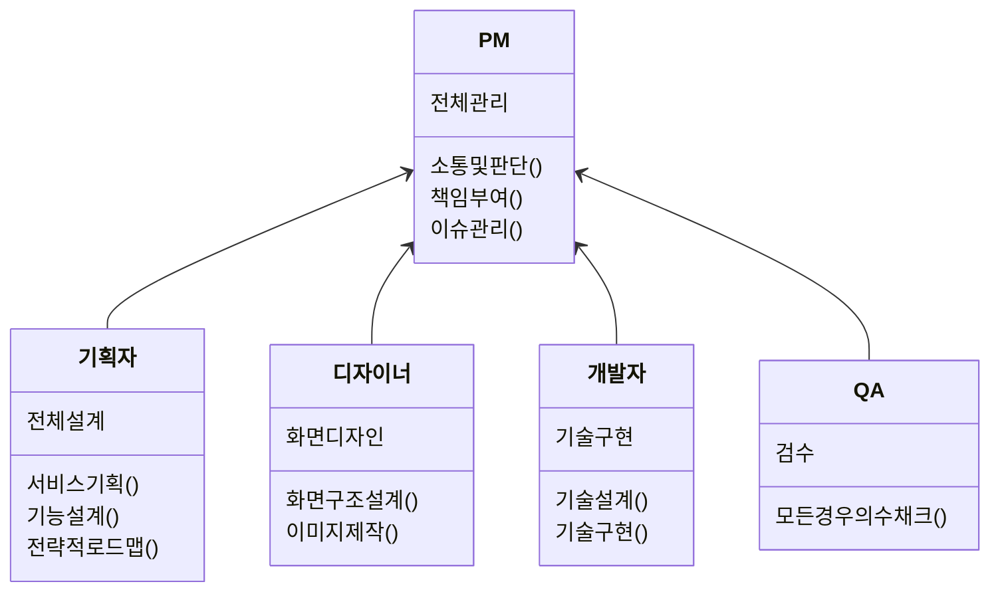
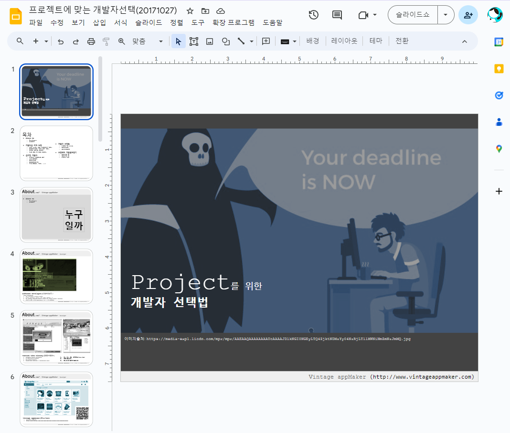

# 1. 프로젝트 기초상식 
 > IT의 프로젝트는 `소프트웨어 공학`에서 제시하는 절차로 진행되어야 한다.  이유는 소프트웨어를 개발하는 것이기 때문이다. 그러나 현실에서는 공학적 process에 대해는 무지하면서 `에자일`을 무비판적 수용하여 실패하는 사례가 많다. 우선적으로 software의 개발방법을 이해하고 후차적으로 에자일을 적용하는 것이 올바른 것이다. 
 
 결과적으로 Software 개발이 공학적으로 어떻게 이루어지는 지부터 알고 프로젝트를 시작해야 한다. 공학적으로 각 파트가 유기적으로 존재하고 있고 순차적 과정을 통해 결과물을 산출한다.  

#TODO 
##### 여기서 질문!
> 🙋🏾‍♀️🙋🏾‍♂️ 
 카카오톡과 배달의 민족은 누가 만들었을까?

## 1.1 팀구성 및 프로젝트 진행 순서

#기획자 #개발자 #디자이너 #QA #프로젝트관리자_PM

- [프로젝트 기초상식](https://docs.google.com/presentation/d/e/2PACX-1vQx0k8wgpt8kFO8z36akS_yUxyEKkS4DZ1n5In8O_YFZlq2l_oho-aKv_y4cqc35hGQszaataf5nmxt/pub?start=false&loop=false&delayms=3000)

## 1.2 Software 팀구성과 개발자 소통 
프로젝트에서 개발자는 전투 유닛으로 오해되는 SCV 같은 builder일  뿐이다. 

- [ 팀구성과 개발자의 대화법](../reference/개발자와_대화법.md)

## 1.3 개발자에 대한 이해 
프로젝트에서 개발자는 어떤 업무를 하고 어떤 존재인지 알아야 한다. 

- [개발자에 대한 오해](https://docs.google.com/presentation/d/e/2PACX-1vR4PH9bYv4CObdTb_gm1C3TA0UOkhPgT3fxjB-myTWlAfaeurXLJVEsRWt7pnCObujPaaOzikRIQt0G/pub?start=false&loop=false&delayms=3000)

## 1.4 내부인력? 외부인력?  
프로젝트는 회사 내부인력으로만 하지 않는다. 때에 따라 외부업체나 인력을 소싱하여 같은 구성원으로 프로젝트 한다. 디자인, 기획, 개발, QA 분야를 가리지 않고 소싱할 때도 많다. 그러므로 내부인력 개념으로 프로젝트를 관리하다보면 문제가 발생할 확률이 높아진다. 

- [외주개발 이야기](http://vintageappmaker.com/apps/devmanager/)
