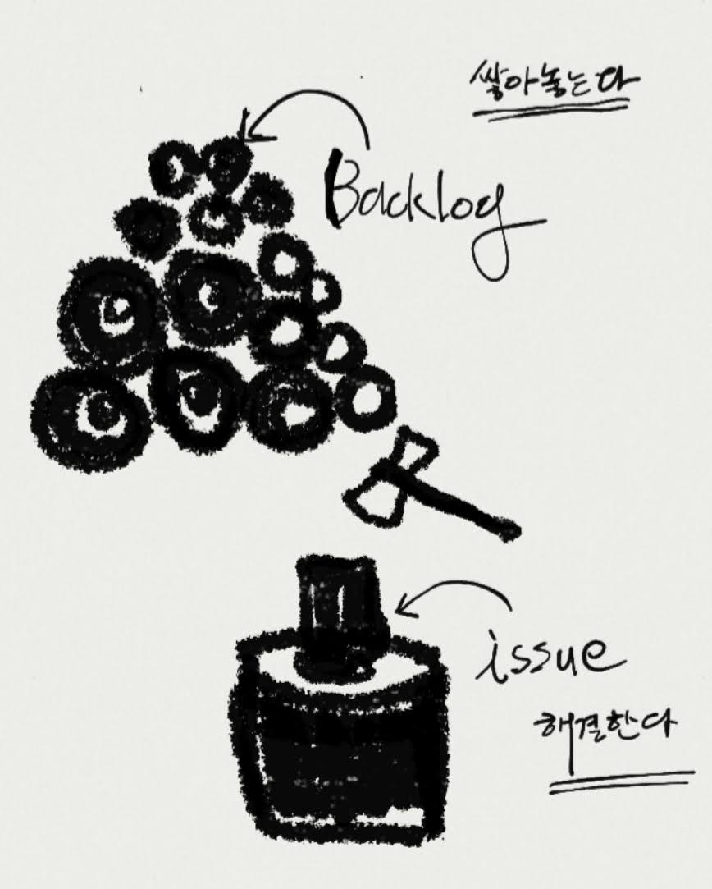
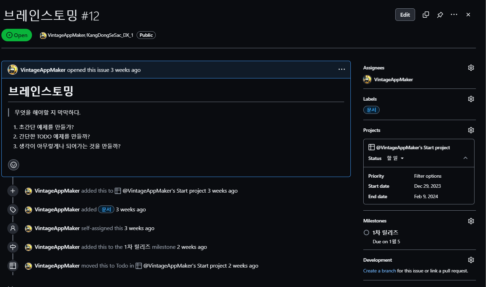

# Project 관리 

## 1. 협업 시스템이 필요한 이유

- `1. 효율성`
  문제(issue)는 복합적이다. 그렇기에 혼자서 해결할 수 없는 것도 issue를 제기하고 올바른 담당자에게 할당하는 것 만으로도 빠르게 해결할 수 있다. 팀원들이 자신에게 할당된  issue를 분석하며 자신의 기술과 지식을 공유하기에  해결책을 찾을 수 있다.
- `2. 능동적인 사고`
  다양성 팀원들의 전문성과 아이디어를 활용한 브레인스토밍 가능.
- `3. 업무 만족도 향상`
  Role에 대한 구체적인 구분이 있으므로 업무불만을 줄일 수 있다.
- `4. 업무역량 기반의 조직문화`
  업무의 우선순위와 계획을 파악하는 조직문화로 인해 생산성이 강화되고 구체적이지 못한  정성적 사고가 줄어든다.    

## 2. 프로젝트 방법론  

> 정해진 하나만 사용하지 않는다. 혼합하며 사용한다. 그리고 무엇보다도 "좋은 방법론"은 존재하지 않는다. 이유는 단순하다. "사람"이기 때문이다. "모든 사람"에게 편하고 효율적인 방법론은 없다.  

Agile의 경우, 방법론을 해석 및 분류하는 것이 사람마다 다르다. 그만큼 혼용되어 사용되고 있다. 

### 2.1 waterfall 

고전적인 방법이라고 하지만, waterfall 방식을 배제한 프로젝트는 존재하지 않는다. waterfall의 단점을 보완하는 방법들을 사용한다. 

~~~mermaid
flowchart TD

A[1.요구사항정의]-->B[2.설계]
B-->C[3.디자인]
C-->D[4.개발]
D-->E[5.테스트]
E-->F[6.배포]

~~~

장점:
- 업무가 명확하다. 
- 할 일이 정확하다. 

단점:
- 요구분석 및 설계가 오래걸린다. 
- `설계와 요구사항이 변경되면 안된다.` 
-  완료되는 시점과 고객만족에 문제가 발생했다.  
### 2.2 Agile 

> 워터폴과 비슷하나 "고객위주"와 "주기적 업데이트"를 통한 변화가 다르다.  십 수년 전부터 대기업 및 스타트 업, 심지어는 공공기관에서 까지 Agile 방법론으로 프로젝트를 진행하고 있다. 

- [공공기관 애자일 관련 기사](http://www.vision21.kr/news/article.html?no=308017)
- [SK의 애자일 홍보](https://skdt.co.kr/bbs/board.php?bo_table=dtblog&wr_id=29286&page=2)
- 아쉽게도 부정적인 내용이 더 많음
	- [한국기업이 애자일이 힘든이유](https://now.rememberapp.co.kr/2020/12/20/11260/)
	- [애자일에 부정적인 면 #1](https://www.ciokorea.com/news/255064)
	- [애자일에 부정적인 면 #2](https://nephrite21.tistory.com/7)
	- [애자일에 부정적인 면 #3](https://m.post.naver.com/viewer/postView.naver?volumeNo=28418333&memberNo=33158794)

~~~mermaid

flowchart LR

A[요구분석] --> B[설계]
B-->C[개발]
C-->D[테스트]
D-->E[출시]
E --> |업데이트를 위한 무한반복| A 

~~~


**Bing으로 요청한 Agile 이미지**

에자일 방법론의 핵심은 한 번 정하면 끝까지 가는 것이 아니라 "때에 따라 바로 수정"을 한다는 점이다.  분명 프로젝트에 따라 평가가 달라지게 된다. 

현업자 입장에서 Agile의 큰 문제점은

1. 빠르다는 환상, 수많은 무책임한 말들
2. 기업문화가 변수임을 무시함
3. 구성원들의 능력에도 관심없음

그럼에도 Software 개발에서 Agile은 중요한 축을 이루고 있음(잘만 활용하면.. 이라는 아쉬움이 남는 것).

#TODO 
##### 여기서 질문!
> 🙋🏾‍♀️🙋🏾‍♂️ 
 Agile은 고객만족도가 높을까?
  
```
[TODO] 각자가 생각하는 결과는?
```

### Ask 생성AI
🤖프롬프트 : "Agile은 고객만족도가 높을까?"
~~~
[TODO] 생성AI 결과는?
~~~

#TODO 
##### 여기서 질문!
> 🙋🏾‍♀️🙋🏾‍♂️ 
  Waterfall이 좋을까? Agile이 좋을까?
  
```
[TODO] 각자가 생각하는 결과는?
```

### Ask 생성AI
🤖프롬프트 : "Waterfall이 좋을까? Agile이 좋을까?"
~~~
[TODO] 생성AI 결과는?
~~~

#### 2.2.1 스크럼 

> 가장 호불호가 갈리는 방법론 
-  점진적 개발 방법론
	- 고객의 요구사항을 충족시키는 데 초점
	- 목표를 짧은 주기로  개발(전달)하는 관리기법
- 스크럼의 추구덕목:
	- 용기 : 팀의 목표를 위해 팀원 간 갈등을 두려워하지 말라.
	- 집중 : 팀의 목표와 약속을 지키기 위해 모든 것을 집중하여야 한다.
	- 확약 : 개인이 공약한 목표 달성을 위해 팀에 헌신하며 약속을 지켜야 한다.
	- 존중 : 자신과 팀원들에게 경의를 표해야 한다. 개인의 다름을 이해해야 한다.
	- 정직 : 자신에게 불리하더라고 모든 내용을 투명하게 공개해야 한다.

#TODO 
### Ask 생성AI
🤖프롬프트 : 
1. "software에서 스크럼 사례"
2. "스크럼이 정말 효율적인가?"
3. "스크럼은 왜? 덕목을 강조하는가?"

~~~
[TODO] 생성AI 결과는?
~~~

#### 2.2.2 칸반 

> 가장 시각적인 방법론. board 형태.
- 일본 토요타에서 사용한 방법 
	- 칸반 is  **간판**(看板)
	- TODO, Progress, Done과 같은 상태로 issue를 관리함.
- 칸반의 특징:
	- Visual 적이다. 상황을 간판으로 이동시키면 된다. 
	- 소프트웨어가 필요하지도 않다. Post- it으로도 가능하다.
	- 진행상황 전체를 한 눈에 볼 수 있다. 

### 2.3 Lean 

> 철저하게 최소화된 리소스를 사용하는 방법론  
-  최소한의 안정된 제품 
	- 고객 요구사항에 집중하되 가능한 것만 빠르게 만든다. 
	- 제조사 위주의  결정구조 
- Lean의 특징 
	- 짧은 주기로 제품출시
	- 빠른 피드백과 개선
	- MVP 개발에 최적화

### Ask 생성AI
🤖프롬프트 : 
1. "leanstarup의 사례는?"
2. "leanstarup의 문제점은?"
## 3. PM의 도구 

1. 과제종료
2. 이슈관리
3. 업무할당
4. 데이터기반의 판단
5. 협업지원

이 모든 것이 가능하려면 `과제진행 문서(기획서, 스토리보드, 디자인가이드, WBS, 각종 문서와 이메일)`와 `이슈관리 시스템(jira, github projects, asana, trello, ...`이 필수가 된다.
## 4. 협업 Software의 목적

- 프로젝트 관리의 목적 :  `정보 공유 및 해결`
- 프로젝트 관리가 필요한 이유
~~~
프로젝트에서 발생하는 문제들은 나쁜 것이 아니다. 
문제가 제때 알려지지않고 추적되지 않을 때 문제다. 
시간이 지나면 사소한 것도 해결할 수 없게 된다. 
~~~

프로젝트 관리 방법은 복잡하다. 그리고 "사용도구" 역시 어렵고 복잡하다. 그러나 본질적으로 3개의 중요한 요소가 [핵심사항]이다.  
### 4.1 Issue

`issue:`  
프로젝트에서 예상되는 업무, 문제점, 개선 사항 등 실제 해야 할 것을 말한다. 그리고 반드시 해결(done)해야 한다. 

`issue 관리:`
프로젝트 내에서 발생하는 문제의 진행 상황을 기록, 추적, 현황 공유 및 사용자(고객)에게 업데이트를 제공하는 것이다.  issue를 등록한 시점부터 해결될 때까지 프로세스를 관리하는 것을 말합니다. 

issue 관리가 없을 경우 경험하는 흔한 시나리오:

~~~pascal
1. 대표이사가 회의만 주구장창한다. 
   : "문제점(issue)이 뭔지 알 수 없기 때문이다"
2. 보고서에는 해결되었다는 데 문제가 많다. 
   : "issue가 추적되지 않기 때문이다"
3. 모든 것을 잃는다.
   : "프로젝트에 참여한 사람, 기간, 과제실패로 인한 금액"
~~~



#### 여기서 질문!
> 🙋🏾‍♀️🙋🏾‍♂️ 
  백로그와 이슈의 차이점은 무엇인가?
  
```
[TODO] 각자가 생각하는 결과는?
```

### Ask 생성AI
🤖프롬프트 : "백로그와 이슈의 차이점은 무엇인가?"
~~~
[TODO] 생성AI 결과는?
~~~
### 4.2 담당자
백로그(상태를 지정하기 이전단계) 이슈가 발생한 후, PM은 내용을 파악한다. 그리고 진행해야 할 가치가 있다고 판단되면 issue를 해결할 담당자를 선정해야 한다.

1. **담당자 지정 시:**
    - 각 이슈에 대해 명확한 담당자를 지정
    - 담당자는 해당 작업이나 이슈에 대한 주요 책임자 
    - 작업을 추진하고 상태를 업데이트하는 주체
2. **issue에 우선순위 지정 시:**
    - 담당자는 자신에게 할당된 작업의 우선순위를 결정한다.
    - 다른 파트에서 설정한 우선순위에 문제가 있다면 이의를 제기하고 수정해야 한다.
    - 결정은 담당자간에 이루어지나 해결하지 못할 경우, PM이 결정한다.
3. **issue 상태 업데이트 시:**
    - 담당자는 자신에게 할당된 작업에 대한 상태를 주기적으로 업데이트.
    - 업데이트 된 정보는 팀 전체 공유.
4. **이슈 해결과 문제 보고:**
    - 담당자는 자신이 담당한 이슈에 대한 해결책을 찾고 적용의 의무가 있다. 
    - 해결에 대한 내용은 검증자가 confirm을 해주어야 해결된다.
5. **협업 요청 시:**
    - 담당자는 자력으로 해결 못할 시, 멘션을 통해 새로운 쓰레드로 요청할 수 있다.
    - PM은 이 상황에 대한 `중계자`가 되어야 하며 협업이 가능하도록 최대한 노력해야 한다.
6. **기한 준수:**
    - 담당자는 할당된 작업의 기한을 준수해야 한다.
    - 기한이 늦어지면 이에 대한 요청을 팀원들에게 할 수 있다. 
    - 이 때, 담당자들간의 협의는 인정되지 않는다. `반드시 PM의 confirm이 추가`되어야 한다.

#TODO 
#### 여기서 질문!
> 🙋🏾‍♀️🙋🏾‍♂️ 
  PM은 담당자 할당을 어떻게 판단할 수 있을까?
  
```
[TODO] 각자가 생각하는 결과는?
```

### Ask 생성AI
🤖프롬프트 : "PM은 담당자 할당을 어떻게 판단할 수 있을까?"
~~~
[TODO] 생성AI 결과는?
~~~

## 4.3 일정(milestone)
>프로젝트 이슈 추적 시스템에서 "Milestone(마일스톤)"은 프로젝트의 중요한 단계나 이벤트를 나타내는 `이정표`다. Milestone은 진행 상황을 추적하고 팀원들에게 중요한 이벤트를 시각화 하는 것을 목적으로 한다. 

특징은 다음과 같다.

| 내용 | 설명 |
| ---- | ---- |
| `시각적` | **milestone은 주로 타임라인이나 gantt 차트** 로 표시된다. 시각적으로 상황을 빠르게 파악하기 위함이다. |
| `진행상황  체크` | 프로젝트의 진행상황이 재대로 되고 수행되고 있는 지 체크 가능하다. |
| `업무 종속성` | milestone간의 종속성을 알 수 있다. 그러므로 어떤 일이 먼저 끝나야 다른 일을 할 수 있는 지, 시각적으로 빠르게 이해할 수 있다. |
|  |  |
~~~mermaid
gantt
    dateFormat HH:mm
    axisFormat %H:%M
    1차 milestone : milestone, m1, 17:49, 2m
    업무 1 : 10m
    업무 2 : 5m
    마지막 milestone : milestone, m2, 18:08, 4m
~~~

### 4.4 진행 기록
> 담당자별, 이슈별 진행기록이 관리되어야 한다.



1. **이슈 트래킹:**
    - 각 이슈에 대한 상세한 이력을 기록 
	    - 이슈의 생성일 
	    - 마지막 수정일 
	    - 담당자 변경
	    - 상태 변화
	- 정보를 관리하여 이슈를 추적할 수 있어야 한다.
2. **실시간 상태출력:**
    - 현재 이슈의 상태를 표시 
	    - 열림(Open)
	    - 진행 중(In Progress)
	    - 완료(Done)
    - 외에도 업무상 추가될 상황들이 발생할 수 있다. 
    - 이럴 때에는 상태를 추가/수정하여 관리한다.
3. **주석과 코멘트:**
    - 이슈에 대한 팀원들간의 의견과 이견을 기록한다.
4. **파일 첨부 기능:**
    - 이슈관련 파일들이 링크되어야 한다.
5. **이슈 이동 및 우선순위 변경:**
    - 이슈의 이동이나 우선순위 변경이 가능해야 한다.
6. **보고서와 검색 기능:**
    - 고객 또는 팀원들과 소통하기 위해 다양한 형태의 보고서로 출력 가능해야 한다.
7. **보안과 권한 관리:**
    - 중요한 이슈의 경우, 보안설정이 된 후 열람가능해야 한다.

### 4.5 리포팅 시스템

## 5. 협업 Software를 다룰 때 자세

#### 5.1 인간이 우선이다. 
~~~python
1. 일을 하는 것은 사람이다. 
2. Software가 작업에 지장을 주어서는 안된다.
3. 그렇다고 관리가 느슨해서도 안된다. 
4. PM과 조직원들은 이슈관리 Software에 대해 합의점을 가져야 한다. 
5. 그래서 이슈관리 소프트웨어 교육에 대한 "사용법 매뉴얼"이 존재해야 한다.
6. "팀원들 모두가 편하게 쓸 수" 있어야 한다.
~~~
#### 5.2 소통이 우선이다. 
~~~python
1. 시스템에 집중하다보면 소통장애도 발생한다. 
2. 소프트웨어가 보여주는 수치에만 집중하다보면 오판하기 쉽다.
3. 소통에 문제가 파악된다면 "오프라인" 미팅을 해야 한다.  
4. 불필요한 이슈를 시스템에서 삭제하는 것도 소통에 도움이 된다.  
~~~
#### 5.3 도구일 뿐 맹신해서는 안된다. 
~~~python
1. Software는 문제를 정리할 뿐 해결해주지 않는다.  
2. 팀 참여자들에겐는 필수 도구 일 수 있다.
3. 그러나 최종 결정자에게는 한 장의 도표만 필요할 때가 많다.  
5. 결과적으로 때에 따라 "다른도구로 정리"가  필요하다.
~~~