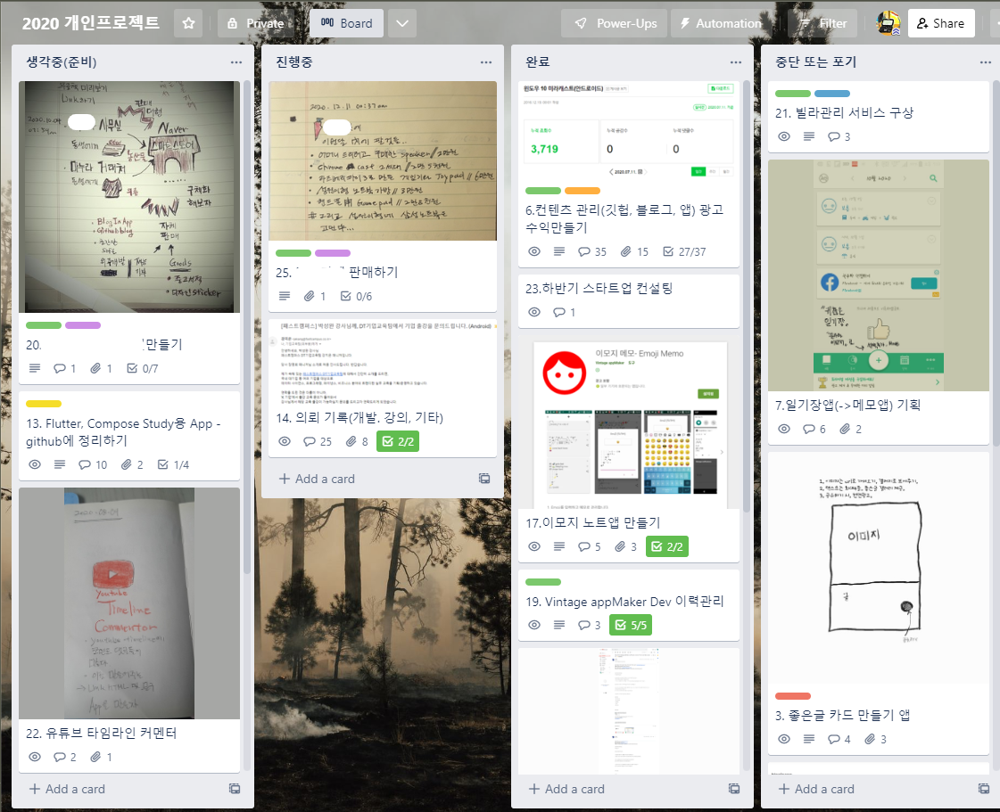
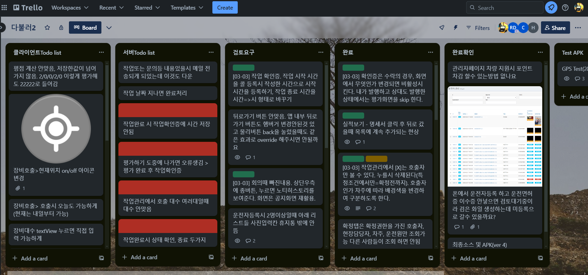
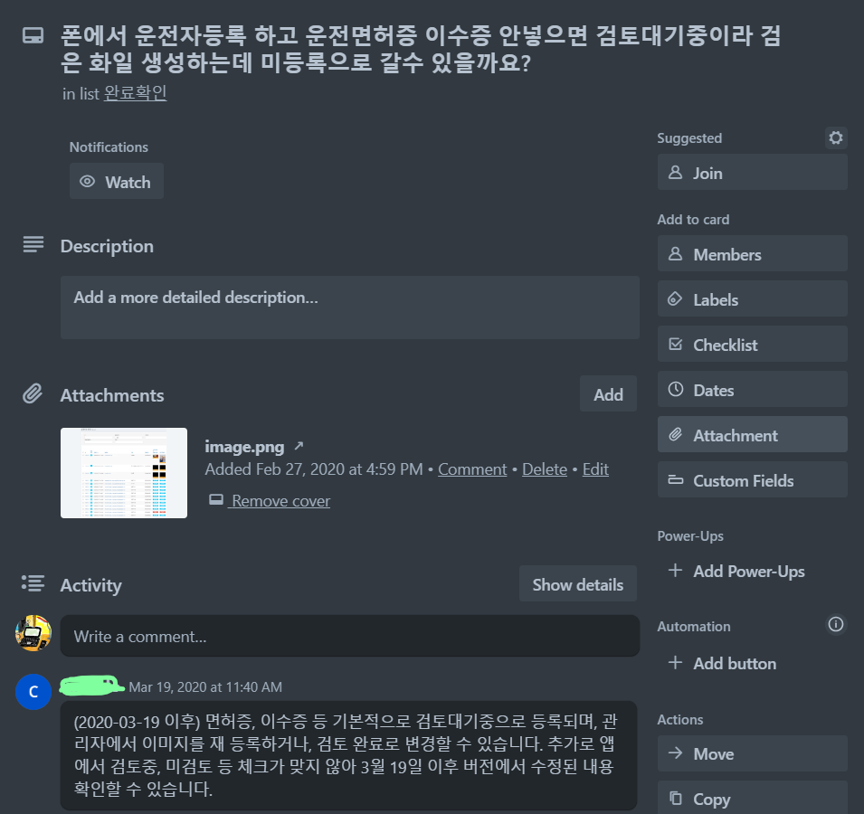

# 1. Issue 관리 

> PM은 issue를 빠르게 판단하고 제거해 나가야 한다. 그렇게 하기 위해서는 issue를 수집, 판단, 정리, 담당자(assigner) 할당과 검토의 작업을 거쳐야 한다. 이는 GTD의 방법론과 매우 유사하다. 

David Allen의 번역서 

이 책에서는 목차를 다음과 같이 하고 있다. 
~~~
4장 준비단계 - 시간, 공간, 도구의 준비  
5장 수집단계 - 업무를 한 곳에 모으기  
6장 가공단계 - 수집함 비우기  
7장 조직화 단계 - 올바른 체크리스트 준비  
8장 검토 단계 - 시스템 가능성 유지  
9장 실천 단계 - 최상의 행동 선택
~~~

위의 4장에서 9장까지의 내용을 6단계로 GTD 프로세스를 사용한다. 그러나 대부분 이를 변형하여 자신의 업무네 알맞게 수정하여 사용한다. 

[구글검색](https://www.google.com/search?q=GTD+%EC%9D%BC%EC%B2%98%EB%A6%AC&sca_esv=594657827&rlz=1C5CHFA_enKR1063KR1063&sxsrf=AM9HkKkG2Ng9RoYKjks5T0TS8vsfQQ2TDg%3A1703983239197&ei=h7iQZf3WC8Ws-QaY_Y_ICQ&ved=0ahUKEwi9trOduLiDAxVFVt4KHZj-A5kQ4dUDCBE&uact=5&oq=GTD+%EC%9D%BC%EC%B2%98%EB%A6%AC&gs_lp=Egxnd3Mtd2l6LXNlcnAiDUdURCDsnbzsspjrpqwyBRAhGKABMgUQIRigAUiCEVDdCFjOD3ADeAGQAQGYAYwBoAH6BqoBAzAuN7gBA8gBAPgBAcICChAAGEcY1gQYsAPCAgUQABiABMICCBAAGIAEGKIE4gMEGAAgQYgGAZAGCg&sclient=gws-wiz-serp)
# 2. issue 관리 시스템 

> issue 관리 시스템은 다양하다. 그러나 관리를 위해 몇 가지 공통점을 가지고 있다. 

1. **이슈 추적 및 기록**: 
   - 시스템을 사용하여 발생한 모든 이슈를 기록하고 추적한다. 
	   (1) 문제 설명
	   (2) 우선 순위 
	   (3) 상태 
	   (4) 담당자 
	   등의 정보를 포함한다.
    
2. **할당 및 우선순위 설정**: 
   - 각각의 이슈에 책임자를 
	   (1) 할당하고, 
	   (2) 작업에 대한 우선순위를 지정
    
3. **작업 관리 및 추적**: 
   - 이슈 관리 시스템을 사용하여 작업의 진행 상황을 추적하고 관리한다. 
	   (1) 작업 완료 상태
	   (2) 진행 상황 
	   (3) 예상 완료일 
	   등을 체계적으로 관리한다.
    
4. **통신 및 협업**: 
   - 이슈 관리 시스템을 통해 팀원들 간에 
	   (1) 의견 교환 
	   (2) 피드백
	   (3) 합의
	   를 진행한다. 
    
5. **보고서 및 분석**: 
   - 시스템은 이슈 및 작업에 대한 
	   (1) 보고서 생성 
	   (2) 데이터 분석 
	   을 한다. 이로 인해 프로젝트 진행 상황을 파악할 수 있다. 결과적으로 
	   (3) 리스크를 식별
	   (4) 개선점
	   의 효과를 얻는다.
    
6. **버전 관리 및 변경 추적**: 
   - (1) 버전 관리를 통한 변화 관리 
	   프로젝트 진행상황을 분석가능

~~~java
issue 관리 시스템은 
사용법이 중요한 것이 아니라 
팀원들의 편의성이 중요하다. 
그런 점에서 

회사와 프로젝트 마다 다르게 운영한다. 
1. 사람이 편해야
2. 일이 수월하기 때문
이다.

결과적으로 프로젝트를 진행하면서 
초기에 "이슈관리 시스템 재교육" 받는 것이 일반적이다. 
~~~
# 3. issue 관리 시스템의 종류

오래 전부터 [MS Prjoect](https://ko.wikipedia.org/wiki/%EB%A7%88%EC%9D%B4%ED%81%AC%EB%A1%9C%EC%86%8C%ED%94%84%ED%8A%B8_%ED%94%84%EB%A1%9C%EC%A0%9D%ED%8A%B8)나 [redmine](https://ko.wikipedia.org/wiki/%EB%A0%88%EB%93%9C%EB%A7%88%EC%9D%B8)같은 issue 관리 시스템이 중대형 프로젝트 업무에서 사용되었다. 그리고 [Trello](https://trello.com/)나 [Asana](https://asana.com/ko), [Bugzilla](https://www.bugzilla.org/), [github issues](https://github.com/features/issues), [youtrack](https://www.jetbrains.com/ko-kr/youtrack/) 같은 issue 관리 시스템도 많이 사용되고 있다.  최근 해외에서는 [monday.com](https://monday.com/lang/ko)이 유튜브 광고를 통해 시장점유율을 높이고 있는 시점이다. 
	
## 3.1 Trello
`Quick start에 최적화`
> kanban 기반의 직관적인  UX를 가지고 있다.
> 복잡하고 치밀한 issue 추적이 아닌 누구나 사용할 수 있는 편의성에 집중
> MS 출신의 개발자([조엘 스폴스키 ](https://ko.wikipedia.org/wiki/%EC%A1%B0%EC%97%98_%EC%8A%A4%ED%8F%AC%EC%8A%A4%ED%82%A4)- 조엘 온 소프트 저자)가 창업하여 5000억에 아틀라시안(jira 개발사)에 매각함

[조엘 스폴스키 ](https://ko.wikipedia.org/wiki/%EC%A1%B0%EC%97%98_%EC%8A%A4%ED%8F%AC%EC%8A%A4%ED%82%A4): MS에서 Excel의 프로그램 관리자. stackoverflow 최초 개발자. Trello 개발자(창업).

[trello 홈페이지](https://trello.com)

~~~python
전문 애자일 팀이 아니라 외부 인력(주로 고객)과 소통을 하고자 한다면 이슈트래커의 기능에 충실한 "jira"나 "github projects"보다는 "trello"가 월등한 만족도를 가지고 있다. 
~~~

- 칸반기반의 카드 UI

- 프로젝트 과정의 이슈정리 

- 이슈 트래킹 기록

#TODO
1. [`Trello 실제 고객과 함께 프로젝트 관리 둘러보기`](https://trello.com)
2. [`Template를 활용하여 빠르게 만들기 `](https://trello.com)
3. [`Trello Quick Start `](4._trello_quickstart.md)

## 3.2 github Projects
`무료 open project에 최적화`
> github은 microsoft가 인수했다.  개발자들에게는 1순위 issue tracker 서비스이며 무료이다. 초기 스타트업이나 Agile 팀에서 github을 이용한 issue tracking을 많이 사용한다. 

`무료서비스 단순하고 직관적인 기능제공`

~~~
github의 repository를 생성하고 그 곳에 issue를 관리하는 방식으로 project를 관리함
~~~

GitHub Projects의 주요 특징과 기능: 
-  **칸반 스타일 보드** : 
	  - GitHub Projects는 
		  (1) 칸반 스타일의 보드를 제공 
		  (2) 작업의 상태를 열과 카드로 시각적으로 표현
		 이를 통해 작업의 진행 상황을 한 눈에 파악할 수 있다. 
-  **커스터마이징** : 
	  - 사용자는 프로젝트에서  
		  (1) 컬럼 추가/수정/삭제 
		  (2) 작업 흐름도(아이템) 커스터마이징 가능
		   To-do, In Progress, Done 등의 기본 상태 
		   외에도 필요한 상태를 추가할 수 있다. 
-  **이슈와의 연동** : 
	  - GitHub의 이슈 트래커와 연결되어 있다.
		  (1) 작업을 추적,  관리
		  (2) 칸반보드를 이용한 이슈 업데이트 
-  **프로젝트 관리 및 협업** : 
	  - 팀원들 간에 프로젝트를 
		  - 관리하고 
		  - 협업하는 
		  - 효율적인 환경 제공
-  **보고서 및 분석 기능** : 
	  - 프로젝트의 진행 상황을 
		  - 보고서로 확인하고 
		  - 분석할 수 있는 기능
		  - 을 제공

[github projects 소개](https://docs.github.com/en/issues/planning-and-tracking-with-projects/learning-about-projects/about-projects)

#TODO 
#### 협업 예제로 배워보기 
> github의 비공개 repository와 프로젝트를 만들고 사용자를 추가하여 기본기능에 대해 학습한다. 

- tutorial

## 3.3 Jira
`유료 대형 project에 최적화`
> Jira는 아틀라시안(Atlassian)이 개발한 이슈 및 프로젝트 관리 소프트웨어이다. 소프트웨어 개발, 프로젝트 관리, 작업 추적 등을 위한 강력한 도구로 널리 사용되고 있다.

`유료서비스이며 클라우드 방식에서 제약있는 무료로 제공함`

- bitbucket과 같은 버전 관리 툴 제공
- 다양한 서비스에 활용(IT 전유물이 아님)
- 다양한 팀들이 사용
	- 애자일 팀 
	- 프로젝트 관리팀
	- 버그 추적 팀
	- Dev Ops 팀
	- 제품 관리 팀
	- Software developer 팀

[jira 소개](https://www.atlassian.com/ko/software/jira/guides/getting-started/introduction#dig-into-specific-features) 

#TODO 
#### 나만의 플래너 예제로 배워보기 
> jira의 기본기능을 위해 플래너 프로젝트를 만들고 기본기능에 대해 학습한다. 

- tutorial