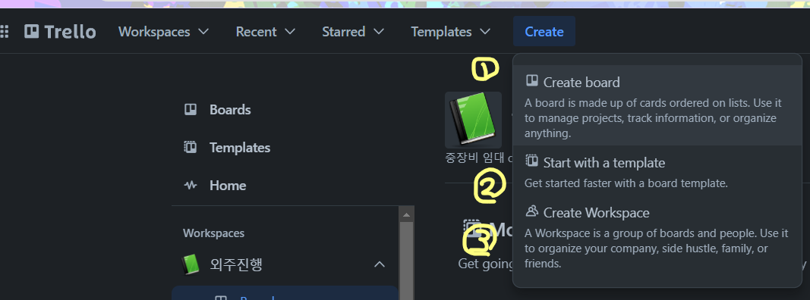
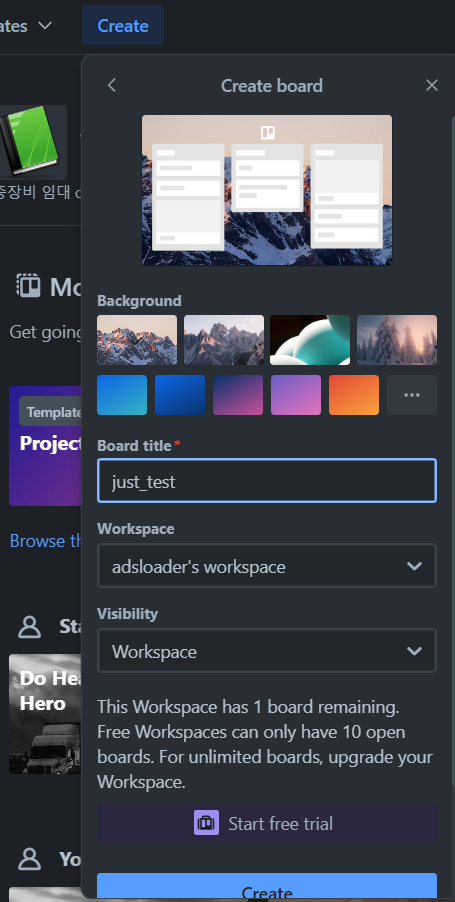
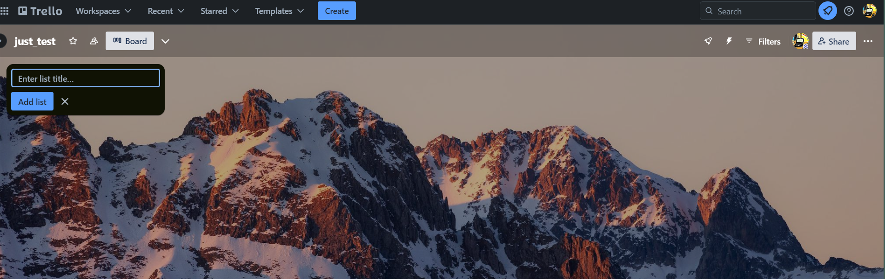
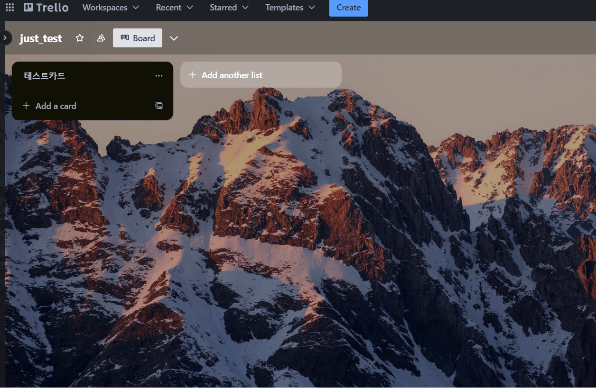
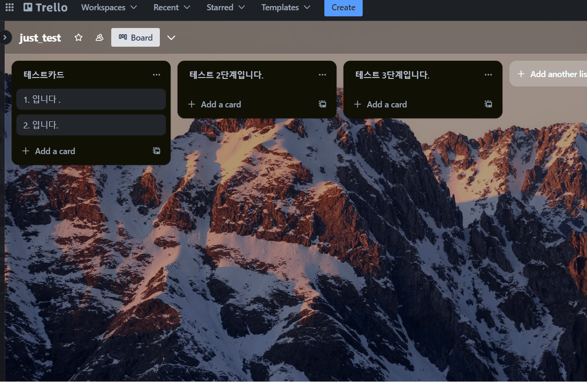
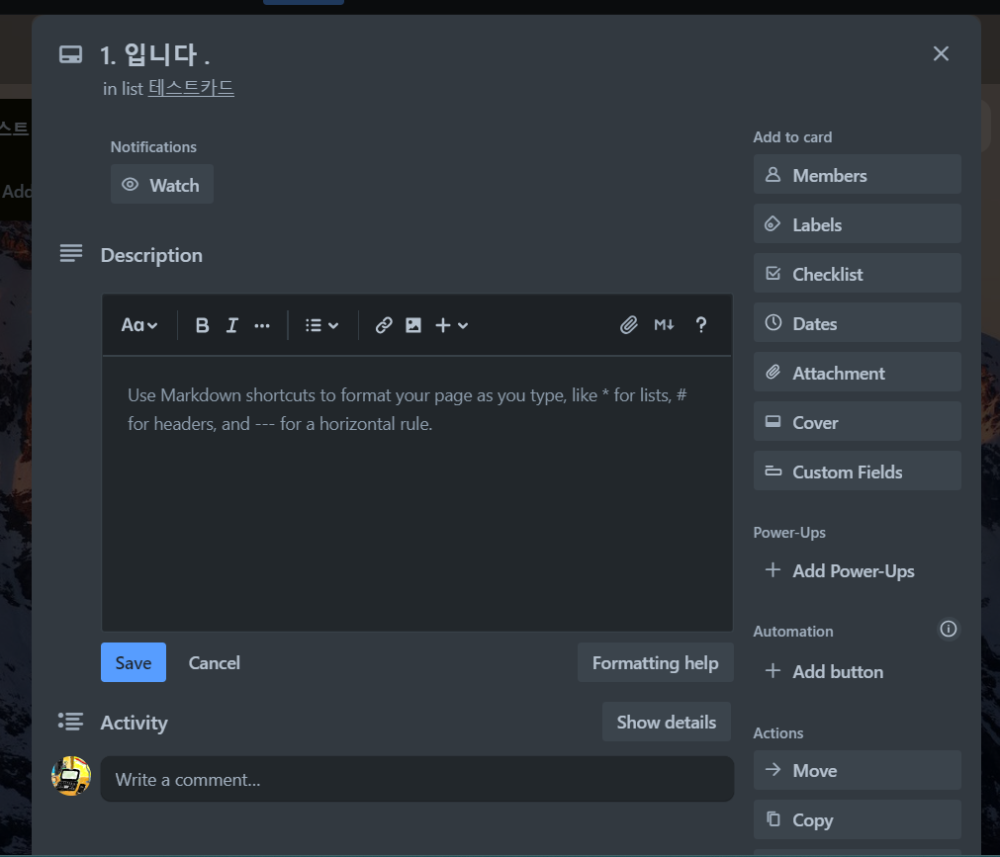
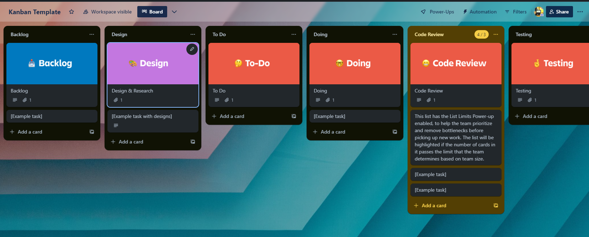
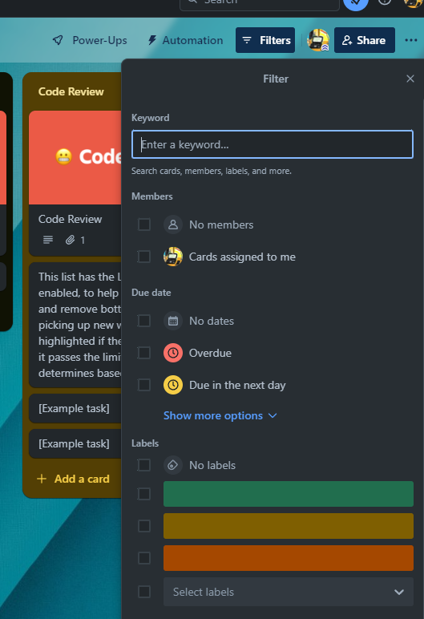

# 1. Trello Quickstart
> Trello를 가입하고 빠르게 사용법을 익혀보기 

## 1.1 가입하기 

- [trello.com](https://trello.com)로 이동한 후 가입하기
## 1.2 필수기능 설명 

- 상단메뉴

	- `Workspaces` : Board를 모아 놓은 개념인 workspace를 보여준다.
	- `Recent` : 최근 사용한 Board나 Workspace를 보여준다.
	- `Starred` : 별표를 준 Board나 워크스페이스(북마크 개념).
	- `Templates` : Trello에서 제공하는 Templates 검색.
	- `Create` : Board나  Workspace를 생성한다.
	
- 생성(Create)

	- `(1) Create board` : Board를 만든다.
	- `(2) Start with a template` : Trello에서 제공하는 Template로 시작한다.
	- `(3) Create board` : Workspace를 만든다.

- Board 생성

	- `Board title` : Board 이름
	- `Workspace` :  Workspace 선택.
	- `Visibility` : private(개인), Workspace(협업), public(모두 공개).

- Board 내에서 card, List 추가

	- board 형태로 직관적으로 보여준다.
	- card를 추가/삭제/수정/이동 가능하다. 
	- add list로 다른 list를 추가 가능하다.
	- List는 Card의 모음이다.
	- Card를 열면 다양한 정보(채크, 일정, 메시지 기록, ...)로 이력 관리된다. `issue`로 사용하면 된다.
	- 

- Board 내에서 card, list 이동

	- Card를 Drag & Drop 가능하다
	- List를 Drag & Drop 가능하다. 
	- 🚧`Drag & Drop을 통해서 상태를 변화`시킨다. Kanban 기반으로 이슈의 상태를 변경한다.

- list 주요기능

	- markdown 기반으로 에디터를 사용한다. 
	- Activity는 기록의 히스토리를 Thread로 보여준다. 
	- Members는 List의 담당자를 할당하거나 협업자를 지정한다.
	- Labels는 List에 대한 Tag를 만들거나 지정한다.
	- CheckList는 List 내에서 TODO를 추가/삭제한다. 진행율도 표시된다.
	- Datas는 Milestones 처럼 일정을 지정ㅎ나다.
	- Attachment는 첨부파일
	- Conver는 list를 보여주는 배경을 지정한다.
	- Custom Fields는 유료이다.
	- Automation(자동화, 트리거)이다. 프로젝트가 커지면 유용한 기능이다.

- Archive 하기/복구/영원히 삭제

	- Card에서 Archive를 선택하면 일단 Archive 영역에 보관된다.
	- Archive 영역에서 Delete를 선택하거나 Archive 후, Delete 키를 선택하면 완전히 삭제된다.

## 1.3 템플릿으로 업무 프로세스 만들기  
메뉴에서 template -> Kanban Template 선택  

- **네이밍룰 정하기**
	- Card의 제목 첫글자에 넘버링 하기
	- 카드의 상태는 레이블로 표시
	- 카드명이 정해지면 함부로 바꾸지 않기
- **업무 프로세스 만들기** 
	- Backlog : 이슈 초기단계
	- Design:  삭제
	- TODO: 할 일로 이름변경
	- Doing: 진행 중으로 이름변경
	- Code Review: 삭제
	- 검수 List : 추가
	- Testng: Drop으로 이름변경
	- 결과: 
		- `backlog` 
		- `할 일`
		- `진행 중`
		- `검수`
		- `완료`
		- `Drop`
- 이슈 등록(Card)
	- 담당자 할당
	- 레이블 지정
		- `아이디어`
		- `기획`
		- `조사`
		- `미팅`
		- `개발`
		- `발표`
		- `계약`
	- TODO  지정
		- 체크 박스로 할 일 추가
		- Group 단위로 정리
	- Durataion 지정
		- MilesStone으로 활용
## 1.6 필터링 검색

Filter를 통하여 card 내의 필요한 정보로 리스트를 정리할 수 있다. 
# 2. Team별 Portfolio 이슈 만들기 - 미션
> 각 팀별 portfolio를 수행하기 위해서 issue 등록 및 관리하기 

#TODO 

1. 팀 중 1명이 Board 생성
2. 팀원들 초청
3. 업무협의 및 이슈수집
4. 이슈분류
5. 이슈수행